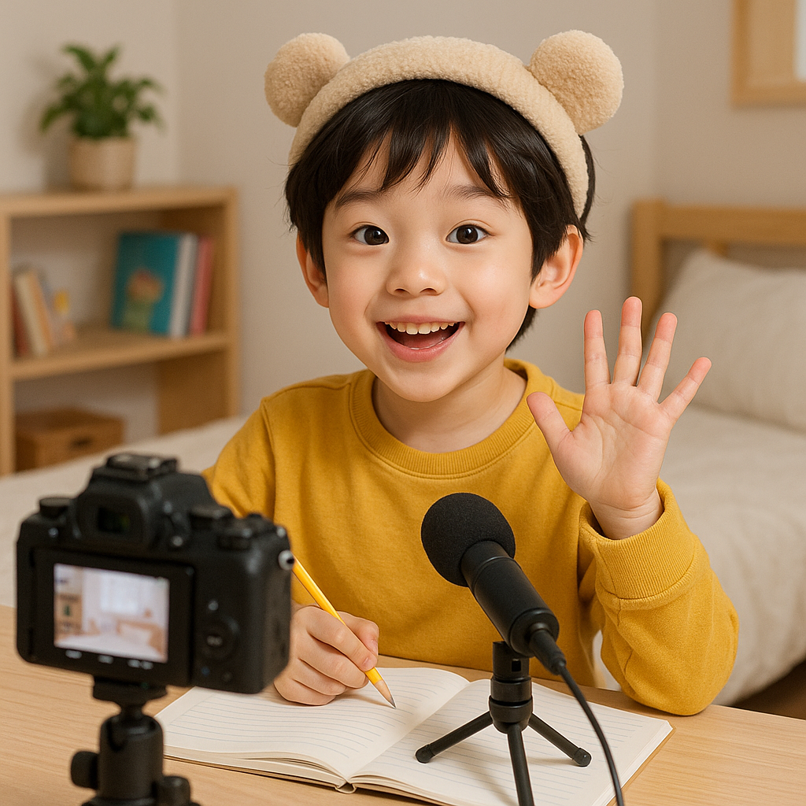
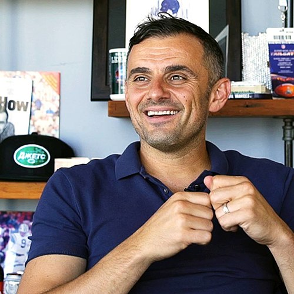

# 1. 엄마, 나 유튜버 해도 될까요?

## 1.1. "탕탕 후루후루" - 신드롬이 된 아이들

요즘 SNS를 뜨겁게 달군 서이브(SeoEve)의 ‘마라탕후루’ 챌린지

**서이브(SeoEve)**의 ‘[마라탕후루](https://www.youtube.com/watch?v=Cs35Hv33dK0)’ 춤, 들어보셨나요?
초등학생 크리에이터 서이브가 선보인 이 춤은 “탕탕 후루후루”라는 중독성 있는 후렴구로 SNS와 틱톡을 뜨겁게 달궜습니다. ‘침착맨’, ‘잇섭’ 등 유명 크리에이터들도 따라 할 정도로 엄청난 **신드롬**이었죠.

마라탕후루 이전에도 마이린, 띠예, 도티, 옐언니 등 수많은 스타 유튜버들을 보며 아이들은 자연스럽게 유튜버의 꿈을 키워왔습니다.

## 1.2. 우리 아이만 그런가요?

실제로 한 설문조사에 따르면, **초등학생의 장래 희망 1위가 ‘유튜버’**로 꼽혔습니다. ([기사 링크](https://www.nocutnews.co.kr/news/5937146))
디지털 네이티브 세대에게 유튜브는 더 이상 단순한 놀이가 아닌, **자신의 창의력을 마음껏 펼치는 중요한 플랫폼**이 된 셈입니다.

## 1.3. 부모님의 현실적인 고민들

자녀가 유튜버가 되고 싶다고 말했을 때, 부모님은 덜컥 걱정부터 앞서는 것이 당연합니다. 과거 일부 유튜버들의 부정적인 모습이 언론을 통해 알려지면서, 유튜브 자체를 해로운 플랫폼으로 인식하는 경우도 많습니다.

> [!IMPORTANT] > **부모님들의 주요 걱정거리**
>
> - "유튜버가 안정적인 직업이 될 수 있을까?"
> - "만약 유튜브 플랫폼이 사라지면 어떡하지?"
> - "악성 댓글이나 온라인 환경이 아이에게 상처를 주지 않을까?"
> - "혹시 게임이나 자극적인 콘텐츠에만 빠지는 건 아닐까?"

이러한 고민은 지극히 자연스러운 반응입니다. 유튜버로 성공하는 것은 매우 어려운 길이며, 변화무쌍한 트렌드에 적응하지 못하면 금방 잊힐 수 있는 불안정한 세상이기도 합니다.

## 1.4. 유튜버, 꼭 나쁘기만 할까요?

아이가 어린 나이에 유튜버를 '직업'으로 삼는 것은 좋은 선택이 아닐 수 있습니다.

하지만 관점을 조금만 바꾸면 유튜브는 **세상에 단 하나뿐인 성장 도구**가 될 수 있습니다.

만약 아이가 **자신의 취미나 학습 활동을 콘텐츠로 만든다**면 어떨까요?
예를 들어, 그림 그리기, 책 리뷰, 코딩 프로젝트 같은 **자기 주도적 활동**을 영상으로 기록하고 사람들과 공유하는 것입니다.

> [!TIP] > **유튜브를 긍정적인 성장 도구로 활용하는 방법**
>
> - **돈이나 인기를 위해서가 아니라,**
> - **나의 성장을 기록하기 위해서**
> - **새로운 것을 배우는 동기부여를 얻기 위해서**
> - **다양한 사람들에게 피드백을 받기 위해서**
>
> 이렇게 목표를 설정한다면, 유튜브는 그 어떤 활동보다 강력한 학습 도구가 될 수 있습니다.

결국 중요한 것은 '유튜브를 하느냐, 마느냐'가 아니라 **'어떤 방향으로, 어떻게 활용하느냐'**입니다.

## 1.5. 어떻게 시작해야 할까요?

> "막상 시작하려니, 채널 개설부터 영상 편집까지 너무 막막해요..."

걱정하지 마세요. 다음 문서부터 채널을 만들고, 첫 영상을 올리는 과정까지 차근차근 함께 알아보겠습니다. 이 가이드는 유튜버로 성공하는 '정답'이 아닌, 스스로 길을 찾아갈 수 있는 '방향'을 알려드립니다.

> [!NOTE] > **왜 '정답'이 아닌 '방향'일까요?**
> 유튜브와 같은 SNS의 트렌드는 끊임없이 변합니다. 어제의 정답이 오늘은 오답이 될 수 있습니다. 따라서 성공 비법을 따르기보다, **트렌드를 읽고, 데이터를 분석하며, 자신만의 콘텐츠를 기획하는 능력**을 기르는 것이 훨씬 중요합니다.

세계적인 마케터 게리 바이너척 또한 끊임없이 콘텐츠를 만들고 소통하며 방향을 찾으라고 조언합니다.

## 1.6. 시작하기 전, 이것만은 꼭! (주의사항)

> [!IMPORTANT]
> 아이와 함께 유튜브를 시작하기 전, 아래 내용을 반드시 숙지하고 약속을 정하세요.
>
> - **개인정보 보호:** 이름, 학교, 집 주소 등 개인을 식별할 수 있는 정보가 영상에 노출되지 않도록 각별히 주의해야 합니다.
> - **악성 댓글 대처:** 상처가 될 수 있는 악성 댓글에 어떻게 대처할지 미리 이야기 나누고, 부모님과 함께 건강하게 이겨내는 방법을 배워야 합니다.
> - **저작권 존중:** 다른 사람의 영상이나 음악을 무단으로 사용하면 안 됩니다. 저작권 걱정 없는 자료를 활용하는 방법을 익혀야 합니다.
> - **수익 창출 조건:** 유튜브로 수익을 창출하려면 **만 14세 이상**이어야 하며, 부모님 동의 하에 애드센스 계정을 연결해야 합니다. (자세한 내용은 추후 다룹니다.)

---

이제 우리 아이의 꿈을 안전하고 슬기롭게 응원할 준비가 되셨나요?
그렇다면 다음 장으로 넘어가 **유튜브 채널을 직접 만들어 보겠습니다.**
