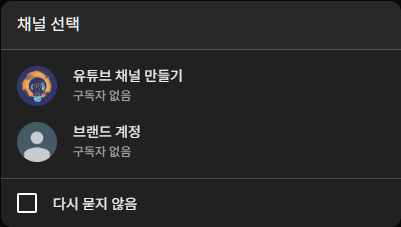

# 2. 유튜브 채널 만들기

> [!NOTE]
> 이 문서는 **2025년 7월 기준**으로 유튜브 채널을 만드는 과정을 안내합니다. 유튜브의 화면은 계속 업데이트될 수 있지만, 기본적인 과정은 크게 달라지지 않습니다.

## 2.1. 채널 개설을 위한 준비물: 구글 계정

> [!IMPORTANT]
> 한국 국적 기준 미성년자의 구글 계정 생성은 제한되니 참고

유튜브는 구글의 서비스 중 하나이므로, 채널을 만들려면 **구글 계정이 반드시 필요합니다.** 아직 구글 계정이 없다면 먼저 가입을 완료해주세요. 이 문서는 구글 계정이 이미 있다는 가정 하에 진행됩니다.

## 2.2. 개인 채널 만들기

1.  **유튜브 접속 및 로그인**

    PC에서 [유튜브](https://www.youtube.com)로 이동하여, 채널에서 사용할 구글 계정으로 로그인해주세요.

    

    > 구글 계정으로 유튜브 로그인

2.  **'채널 만들기' 메뉴 찾기**

    로그인 후, 오른쪽 상단의 동그란 프로필 아이콘을 클릭하면 메뉴가 나타납니다. 여기서 **채널 만들기**를 선택하세요.

    

    > 유튜브 오른쪽 상단 프로필 > 채널 만들기

3.  **채널 정보 입력하기**

    - **이름:** 채널의 이름(활동명)을 정하는 공간입니다. 원하는 활동명으로 자유롭게 설정하세요.
    - **핸들(Handle):** 핸들은 `@mychannel`처럼 표시되는 채널의 고유 주소입니다. 다른 사람이 먼저 사용하고 있지 않은 이름으로 만들어야 하며, 시청자들이 내 채널을 찾거나 언급할 때 사용됩니다. 채널의 개성을 잘 나타내는 이름으로 정하는 것이 좋습니다.
    - **프로필 사진:** 채널을 대표할 이미지를 업로드합니다. 채널을 잘 표현하는 이미지로 선택해보세요. 이 단계는 나중에 설정할 수도 있습니다.

    

    > 채널 이름, 핸들, 프로필 사진 설정 화면

4.  **채널 만들기 완료**

    정보 입력을 마쳤다면 **채널 만들기** 버튼을 클릭하세요. 잠시 후 당신만의 유튜브 채널 홈페이지로 이동합니다. 축하합니다! 첫 채널 만들기가 성공적으로 끝났습니다.

    

    > 생성된 나의 유튜브 채널 홈

## 2.3. 개인 채널 vs. 브랜드 채널: 무엇을 선택해야 할까?

방금 만든 채널은 **개인 채널**입니다. 하지만 유튜브에는 **브랜드 채널**이라는 종류도 있습니다. 채널을 본격적으로 운영하기 전, 두 채널의 차이점을 알아보고 나의 활동 계획에 맞는 채널을 선택하는 것이 좋습니다.

| 구분          | 개인 채널 (Personal Channel)                              | 브랜드 채널 (Brand Channel)                                                     |
| :------------ | :-------------------------------------------------------- | :------------------------------------------------------------------------------ |
| **컨셉**      | **나 개인**의 채널                                        | **독립된 이름**을 가진 채널                                                     |
| **장점**      | 만들기가 매우 간단함                                      | 채널 이름 변경이 자유로움, **여러 명이 함께 관리하기 편리함**, 소유권 이전 가능 |
| **단점**      | 채널 이름 변경 시 구글 계정 전체에 영향, 혼자만 관리 가능 | 초기 설정이 조금 더 복잡함                                                      |
| **소유자**    | 구글 계정 소유자 1명                                      | 구글 계정 소유자 + **여러 명의 관리자**                                         |
| **이름**      | 구글 계정 이름과 동일 (변경 시 구글 프로필 전체에 영향)   | 채널 이름 자유롭게 설정 가능                                                    |
| **관리**      | 채널 소유자만 관리 가능                                   | 여러 구글 계정으로 공동 관리 가능 (매니저, 편집자 등 역할 부여)                 |
| **추천 대상** | 개인적인 취미 채널 등 **1인 운영**                        | **팀으로 운영**하거나, 향후 채널을 더 키워나갈 계획이 있을 때                   |

> [!TIP]
> 처음에는 개인 채널로 시작했더라도, 나중에 브랜드 채널로 전환할 수 있습니다. 하지만 처음부터 **누군가와 함께 채널을 관리**할 계획이라면, 브랜드 채널로 시작하는 것이 훨씬 편리합니다.

## 브랜드 채널 만드는 방법

브랜드 채널은 기존 개인 채널과 별개로, 같은 구글 계정 안에 새로 만들 수 있습니다.

1.  **유튜브 설정으로 이동**
    오른쪽 상단 프로필 아이콘 클릭 -> **설정**으로 들어갑니다.

    

    > 유튜브 설정 메뉴

2.  **채널 추가 또는 관리 메뉴 선택**
    **내 채널** 섹션에서 **새 채널 만들기**를 클릭합니다.

    

    > 채널 추가 또는 관리

3.  **브랜드 채널 이름 입력**
    여기서 만드는 채널이 바로 브랜드 채널입니다. 원하는 채널 이름을 입력하고, 안내 문구에 동의 체크 후 **만들기** 버튼을 누릅니다.

    

    > 브랜드 채널 이름 입력 및 생성

이제 당신의 구글 계정 하나에 개인 채널과 브랜드 채널이 모두 연결되었습니다. 프로필 아이콘을 눌러 **계정 전환** 메뉴를 통해 두 채널을 자유롭게 오가며 관리할 수 있습니다.

---

채널 만들기를 마쳤으니, 다음 단계는 **채널의 개성을 보여주도록 이름을 정하고 꾸미는 일**입니다. 다음 문서에서 자세히 알아보겠습니다.
