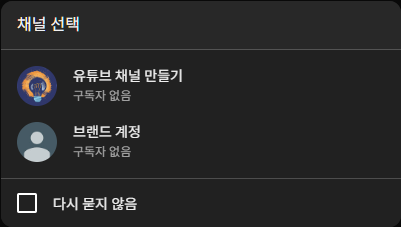
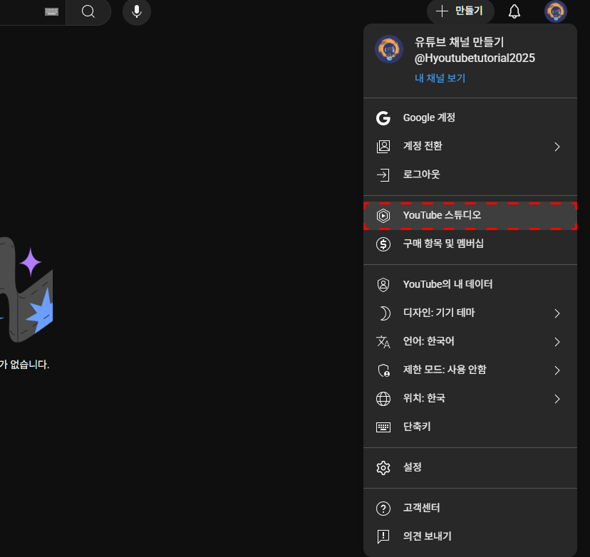
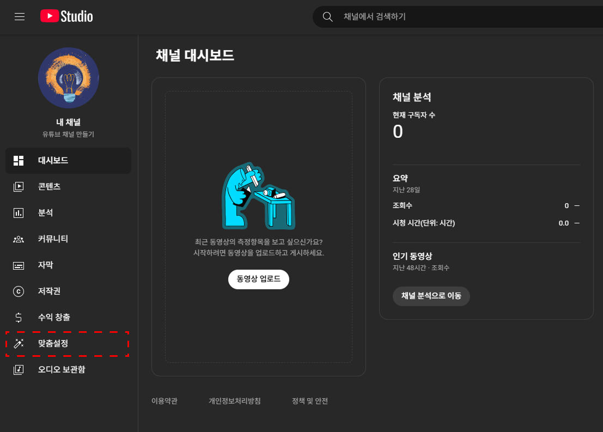
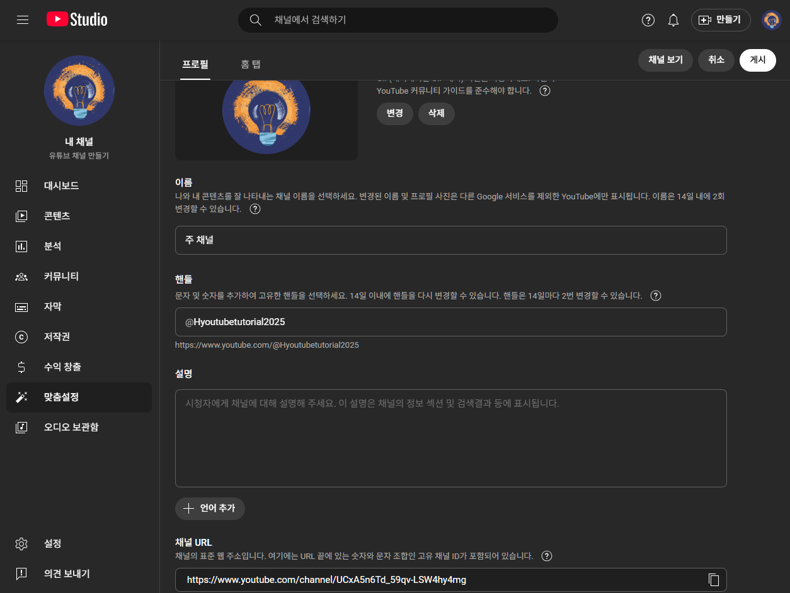
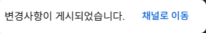

# 3. 채널 이름과 핸들 정하기

> [!NOTE]
> 이 문서는 **2025년 7월 기준**으로 유튜브 채널의 이름과 핸들을 변경하는 방법을 안내합니다. 유튜브의 화면은 계속 업데이트될 수 있지만, 기본적인 과정은 크게 달라지지 않습니다.

## 3.1. 이름 변경 전, 꼭 확인하세요!

채널 이름을 바꾸기 전에, 현재 채널이 **개인 채널**인지 **브랜드 채널**인지 반드시 확인해야 합니다. 변경 방식과 그 영향이 전혀 다르기 때문입니다.

- **개인 채널:** 채널 이름을 바꾸면 **연결된 구글 계정의 이름(Gmail 등)도 함께 변경**됩니다. 본명으로 된 구글 계정이라면 특히 주의해야 합니다.
- **브랜드 채널:** 구글 계정 이름과 별개로 **채널 이름만 독립적으로 변경**할 수 있어 자유롭습니다.

> [!IMPORTANT]
> 구글 계정의 본명을 유지하면서 유튜브 활동명만 자유롭게 사용하고 싶다면, **브랜드 채널을 사용**하는 것을 강력히 권장합니다. (브랜드 채널 생성법은 [이전 문서](/02-Create-YT-Channel.md#브랜드-채널-만드는-방법)를 참고하세요.)

## 3.2 채널 이름, 어떻게 바꿀까요?

> [!WARNING]
> 채널 이름은 **14일에 2번**만 변경할 수 있으니, 신중하게 결정해주세요.

채널 이름 변경은 **[YouTube 스튜디오]** 라는 관리자 페이지에서 진행합니다. 앞으로 **모든 채널 관리는 YouTube 스튜디오**에서 이루어지니 기억해주세요.

1.  **YouTube 스튜디오 들어가기**

    이름을 변경할 채널에 로그인된 상태에서, 오른쪽 상단 프로필 아이콘을 클릭 후 **[YouTube 스튜디오]**로 들어갑니다.

    

    > YouTube 스튜디오 메뉴

2.  **맞춤설정 메뉴로 이동하기**
    왼쪽 메뉴 바에서 **[맞춤설정]** 탭을 클릭합니다.

    

    > 맞춤설정 탭

3.  **새로운 이름 입력하기**
    상단의 **[기본 정보]** 탭을 선택하고, **[이름]** 섹션의 연필 아이콘을 클릭하여 새로운 채널 이름을 입력합니다.

    

    > 기본 정보 > 이름 수정 화면

4.  **변경 내용 저장하기**
    이름 수정이 완료되었다면, 오른쪽 상단의 **[게시]** 버튼을 클릭해야 최종적으로 저장됩니다. 변경사항이 실제 채널에 반영되기까지는 약간의 시간이 걸릴 수 있습니다.

    

## 3.3 채널의 고유 주소, 핸들(Handle) 변경하기

핸들(`@handle`)은 채널의 고유한 아이디 같은 역할을 합니다. 이름과 별개로 변경할 수 있습니다.

1.  **기본 정보 탭에서 핸들 수정하기**
    이름을 변경했던 **[맞춤설정] > [기본 정보]** 탭에서 **[핸들]** 섹션을 찾습니다. 원하는 핸들을 입력하면, 다른 채널에서 사용 중이지 않은 경우 녹색 체크 표시가 나타납니다.

    

    > 기본 정보 > 핸들 수정 화면

2.  **변경 내용 저장하기**
    수정이 완료되면 오른쪽 상단의 **[게시]** 버튼을 눌러 저장합니다.

    

> [!TIP]
> 좋은 핸들은 채널 이름과 연관성이 있으면서, 기억하고 말하기 쉬운 것입니다. 시청자들이 당신의 채널을 쉽게 찾고 언급할 수 있도록 도와줍니다.

채널의 이름과 핸들을 정했다면, 이제 시각적인 요소들로 **채널을 매력적으로 꾸며볼 차례**입니다. 다음 문서에서 채널 꾸미기 방법을 알아보겠습니다.
