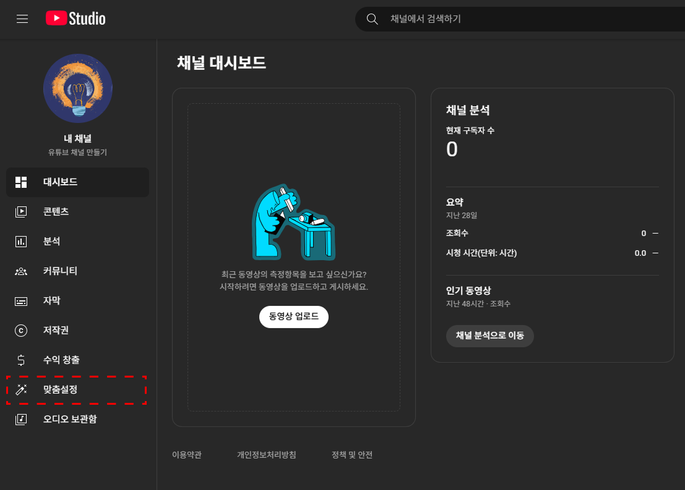

# 4. 채널 꾸미기

> [!NOTE]
> 이 문서는 **2025년 7월 기준**으로 유튜브 채널의 시각적 요소와 구성을 설정하는 방법을 안내합니다. 유튜브의 화면은 계속 업데이트될 수 있지만, 기본적인 과정은 크게 달라지지 않습니다.

## 4.1. 채널 꾸미기는 어디서 할까? [맞춤설정] 메뉴

채널 꾸미기의 모든 기능은 **YouTube 스튜디오**의 **[맞춤설정]** 메뉴 안에 모여있습니다.

1.  꾸미고 싶은 채널로 로그인 후, 오른쪽 상단 프로필 아이콘 클릭 > **YouTube 스튜디오**로 이동합니다.
2.  왼쪽 메뉴 바에서 **[맞춤설정]** 탭을 클릭하면, **[레이아웃]**, **[브랜딩]**, **[기본 정보]** 세 가지 탭이 나타납니다.

    

    > YouTube 스튜디오 > 맞춤설정 탭

## 4.2. 브랜딩: 내 채널의 얼굴 만들기

**[브랜딩]** 탭에서는 채널의 첫인상을 결정하는 프로필, 배너, 워터마크를 설정합니다. 채널의 정체성을 시각적으로 보여주는 가장 중요한 요소들입니다.

### 프로필 사진: 채널의 로고

- **역할:** 채널의 로고이자 얼굴입니다. 내 동영상은 물론, 다른 채널에 댓글을 달 때도 항상 표시되므로, 채널의 정체성을 가장 잘 나타내는 이미지로 신중하게 선택해야 합니다.
- **권장 사양:** 98x98 픽셀 이상의 정사각형 이미지 (PNG, GIF(애니메이션 없음), BMP, JPG 파일)

  > [!TIP]
  > 선명하고 단순한 이미지가 좋습니다. 복잡한 그림이나 글씨는 작은 크기에서 잘 보이지 않을 수 있습니다. 나를 잘 표현하는 사진이나 채널 주제를 상징하는 아이콘을 추천합니다.

  

  > 프로필 사진 설정

### 배너 이미지: 채널의 주제를 알리는 간판

- **역할:** 채널 홈페이지 상단에 크게 보이는 이미지로, 방문자에게 "이 채널은 이런 곳이구나!" 하고 한눈에 알려주는 역할을 합니다.
- **권장 사양:** 2048x1152 픽셀 이상, 6MB 이하의 이미지

  > [!IMPORTANT]
  > 배너는 TV, PC, 스마트폰 등 기기마다 보이는 영역이 다릅니다. 로고, 채널 이름, 업로드 일정 같은 핵심 정보는 모든 기기에서 잘리지 않도록 중앙의 **'안전 영역(1235x338 픽셀)'** 안에 꼭 배치해야 합니다.

  

  > 배너 이미지 설정 및 기기별 노출 영역 안내

### 동영상 워터마크: 모든 영상에 찍는 채널의 도장

- **역할:** 업로드한 모든 동영상의 오른쪽 하단에 표시되는 작은 구독 버튼입니다. 시청자가 영상을 보다가 자연스럽게 채널을 구독하도록 유도하는 매우 효과적인 기능입니다.
- **권장 사양:** 150x150 픽셀의 정사각형 이미지 (1MB 이하)
- **표시 시간:** **[전체 동영상]**으로 설정하여 영상이 재생되는 내내 표시되도록 하는 것을 권장합니다.

  > [!TIP]
  > 배경이 투명한 PNG 파일을 사용하면 영상에 깔끔하게 적용됩니다. '구독'이라는 글자가 포함된 간단한 이미지를 많이 사용합니다.

  

  > 동영상 워터마크 설정

## 4.3. 레이아웃: 내 콘텐츠, 효과적으로 보여주기

**[레이아웃]** 탭에서는 채널 홈페이지에 어떤 영상들을 보여줄지 배치하여, 방문한 시청자들이 더 많은 영상을 보도록 유도할 수 있습니다.

- **동영상 스포트라이트:**
  - **채널 예고편 (처음 온 방문자용):** 내 채널을 처음 방문한 사람에게 보여줄 소개 영상입니다. 채널의 매력을 30초~1분 내외로 압축해서 보여주는 것이 효과적입니다.
  - **추천 동영상 (다시 온 구독자용):** 이미 구독한 사람에게 보여줄 영상입니다. 최신 영상이나 특별히 자랑하고 싶은 영상을 설정해두면 좋습니다.
- **추천 섹션:**

  - 채널 홈페이지의 동영상을 주제별로 묶어 보여주는 기능입니다. **[+ 섹션 추가]**를 눌러 최대 12개까지 만들 수 있습니다.
  - 이렇게 배치해보세요 (예시):
    1. **최신 동영상:** 시청자가 가장 최근 소식을 바로 볼 수 있도록
    2. **인기 동영상:** 내 채널의 매력을 검증된 콘텐츠로 보여주기 위해
    3. **주제별 재생목록:** (ex. '초보자 가이드', '제품 리뷰' 등) 시청자가 관심 있는 주제를 깊게 탐색하도록 유도

  

  > 레이아웃(스포트라이트, 추천 섹션) 설정

## 4.4 기본 정보: 채널에 대한 상세 정보

**[기본 정보]** 탭에서는 채널에 대한 상세한 설명을 추가하고 외부 링크를 연결할 수 있습니다.

- **설명:** 시청자와 유튜브 검색엔진에게 내 채널이 어떤 곳인지 알려주는 중요한 공간입니다. 채널의 주제, 다루는 콘텐츠, 업로드 일정 등과 관련된 **핵심 키워드를 자연스럽게 포함**시키면 검색에 더 잘 노출될 수 있습니다.
- **링크:** 운영하는 SNS(인스타그램, 틱톡 등)나 웹사이트 링크를 추가하여 시청자와의 소통 창구를 넓힐 수 있습니다. 추가된 링크는 채널 배너에 아이콘으로 표시됩니다.
- **연락처 정보:** 협업이나 비즈니스 문의를 받을 이메일 주소를 남겨두면 새로운 기회가 생길 수 있습니다.

> [!IMPORTANT]
>
> **브랜딩**, **레이아웃**, **기본 정보** 탭에서 수정한 모든 내용은 오른쪽 상단의 **게시** 버튼을 눌러야 최종적으로 채널에 반영됩니다. 잊지 말고 꼭 눌러주세요!

이제 당신의 채널이 시청자를 맞이할 준비를 마쳤습니다. 다음 단계는 **채널의 핵심인 동영상을 올리는 것**입니다. 다음 문서에서 자세히 알아보겠습니다.
