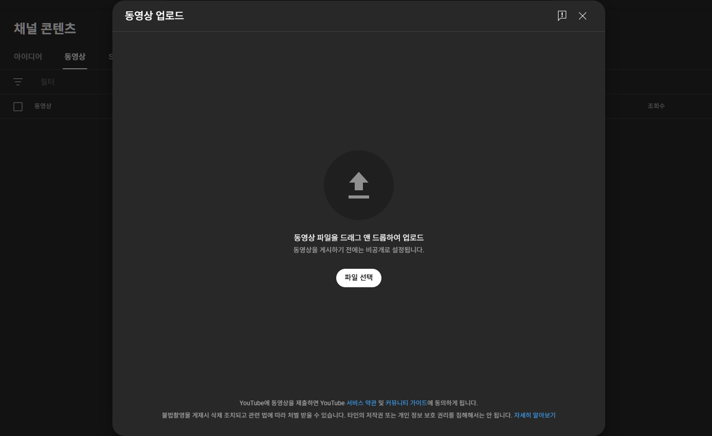
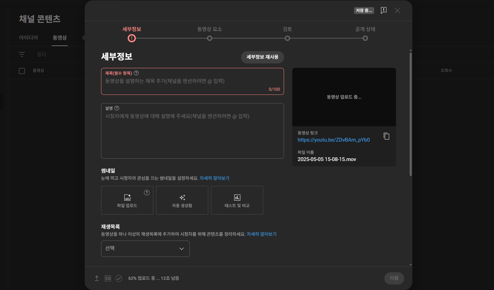
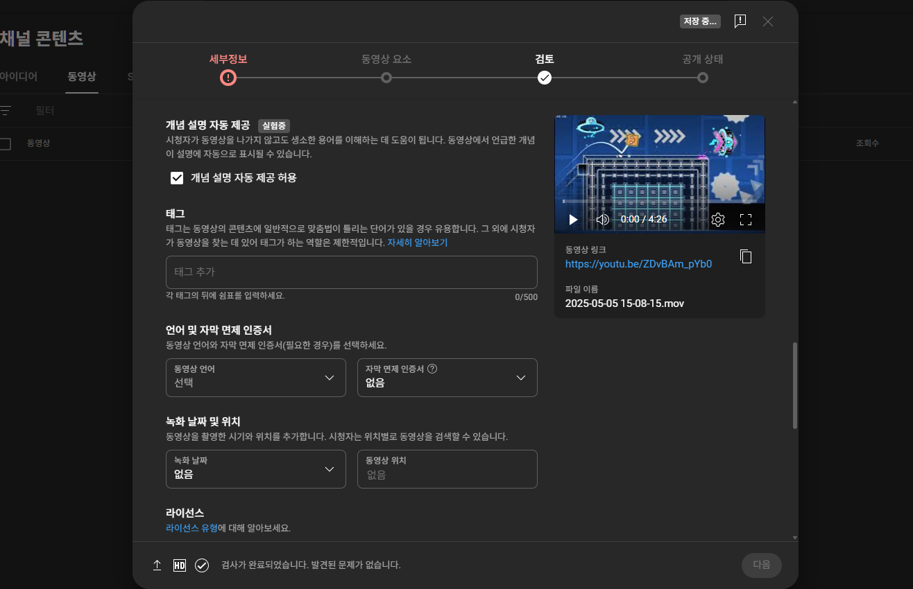
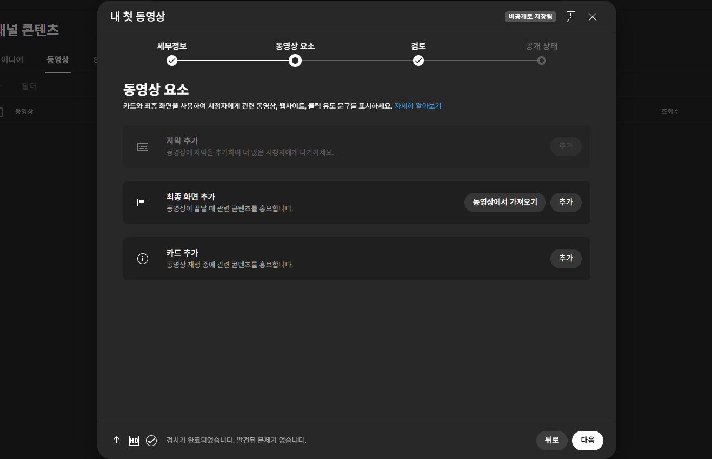
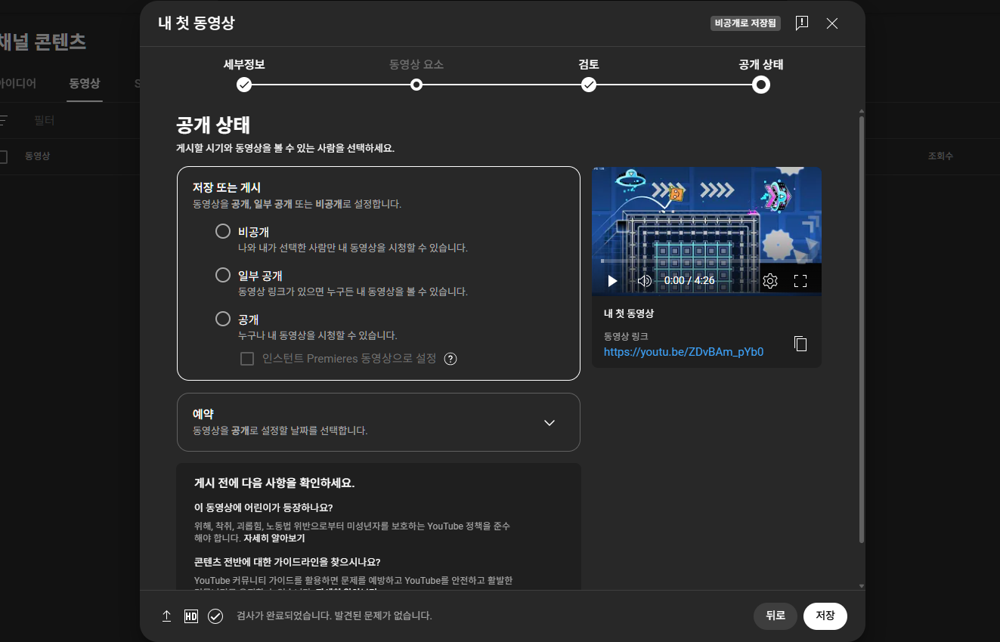
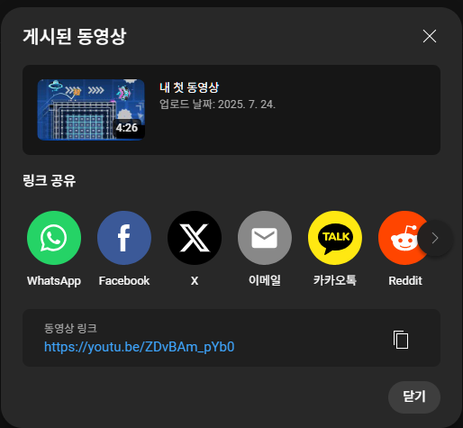

# 5. 첫 동영상 업로드하기

> [!NOTE]
> 이 문서는 **2025년 7월 기준**으로 유튜브에 동영상을 업로드하는 전체 과정을 안내합니다. 유튜브의 화면은 계속 업데이트될 수 있지만, 기본적인 과정은 크게 달라지지 않습니다.

## 5.1. 업로드 시작하기

1.  유튜브 사이트 오른쪽 상단, 프로필 아이콘 왼쪽에 있는 **만들기**를 클릭합니다.
2.  나타나는 메뉴에서 **[동영상 업로드]**를 선택합니다.
3.  **[파일 선택]** 버튼을 누르거나, 동영상 파일을 마우스로 끌어다 놓아 업로드를 시작합니다.

> 동영상 업로드 시작 화면

파일 업로드가 진행되는 동안, 동영상의 성패를 결정할 **세부 정보**를 입력하는 가장 중요한 단계가 시작됩니다. 이 정보를 어떻게 입력하느냐에 따라, 유튜브 알고리즘이 당신의 영상을 더 많은 사람들에게 추천해줄 수 있습니다.

## 5.2. 세부정보 입력: 내 영상을 똑똑하게 소개하는 방법

> 동영상 세부정보 입력 전체 화면

1.  **제목 (가장 중요!):**

    - **전략:** 시청자의 호기심을 자극하면서도, 영상의 핵심 내용을 알 수 있는 키워드를 반드시 포함해야 합니다. "내가 시청자라면 어떤 제목을 클릭할까?"를 고민해보세요. (예: "초보자를 위한 역대급 쉬운 스파게티 만들기 (이것 하나면 끝)")

2.  **미리보기 이미지 (썸네일):**

    - **역할:** 제목과 함께 시청자의 클릭을 결정하는 가장 중요한 '얼굴'입니다. 서점에서 책 표지를 보고 책을 고르듯, 시청자는 썸네일을 보고 영상을 선택합니다.
    - **전략:** 밝고 선명한 고화질 이미지를 사용하고, 영상의 핵심 내용을 담은 굵은 텍스트를 넣어 가독성을 높여주세요. 인물의 표정이 재미있게 드러나는 것도 클릭률을 높이는 좋은 방법입니다.

      > [!Important]
      > 썸네일을 업로드하려면 전화번호 인증이 필요합니다. 이 페이지에선 전화번호 인증을 생략합니다.

3.  **설명:**

    - **역할:** 유튜브 검색엔진(알고리즘)이 영상의 주제를 파악하는 중요한 텍스트 영역입니다.
    - **전략:** 첫 2~3줄에 제목과 연관된 핵심 내용을 요약해서 적어주세요. (시청자가 '더보기'를 누르기 전에 보이는 부분입니다.)
    - **타임스탬프** (예: 00:00 인트로, 01:23 재료 소개)를 추가하여 시청자들이 원하는 부분을 쉽게 찾아볼 수 있도록 배려해주세요. (자동으로 챕터가 생성됩니다.)
    - 영상과 관련된 정보, 사용한 장비나 제품 링크, 참고 자료 등을 상세히 적어주면 채널의 신뢰도를 높일 수 있습니다.

4.  **해시태그:**

    - **역할:** 시청자에게는 직접 보이지 않지만, 유튜브 알고리즘에게 "이 영상은 이런 주제와 관련이 있어요!"라고 알려주는 비밀 키워드입니다.
    - **전략:** **자세히 보기**를 클릭하면 태그 입력란이 나타납니다. 내 영상을 설명하는 다양한 키워드를 입력하세요.
      - **메인 키워드:** (예: 스파게티, 토마토파스타)
      - **세부 키워드:** (예: 10분요리, 자취요리, 간단한레시피)
      - **확장 키워드:** (예: 파스타맛있게만드는법, 소스황금비율)

    

    > '자세히 보기'를 눌러 태그 추가하기

5.  **재생목록 및 시청자층:**
    - **재생목록:** 관련된 주제의 영상들을 묶어두면 시청자들이 자연스럽게 다음 영상을 보도록 유도할 수 있습니다. (예: '10분 완성 요리' 재생목록)
    - **시청자층:** **[아니요, 아동용이 아닙니다]**로 선택하는 것이 일반적입니다. '아동용'으로 설정 시 댓글 기능 등이 제한되어 시청자와의 소통이 어려워질 수 있습니다.

## 5.3. 동영상 요소와 검토: 시청자 만족도 높이기

1.  **동영상 요소:**
    - **최종 화면:** 영상이 끝나기 5~20초 전에 다른 동영상이나 구독 버튼을 화면에 띄워, 시청자가 다른 곳으로 떠나지 않고 내 채널에 더 머무르도록 유도하세요.
    - **카드:** 영상 중간에 관련된 다른 영상을 추천하는 작은 아이콘을 띄울 수 있습니다.
2.  **검토:**
    - 유튜브가 영상에 사용된 음악이나 영상이 저작권을 침해하지는 않았는지 자동으로 확인합니다. 여기서 문제가 발견되면 게시 전에 수정하는 것이 안전합니다.

## 5.4. 공개 상태: 계획적으로 영상 공개하기

1.  **공개 상태 선택:**
    - **비공개:** 나와 내가 초대한 사람만 볼 수 있습니다. (업로드 테스트용)
    - **일부 공개:** 링크가 있는 사람만 볼 수 있습니다. (게시 전 지인에게 미리 보여주고 피드백을 받을 때 유용합니다.)
    - **공개:** 즉시 모든 사람에게 동영상을 공개합니다.
2.  **예약 (강력 추천):**

    - **전략:** 원하는 날짜와 시간을 지정하여 동영상이 자동으로 공개되도록 설정할 수 있습니다. 매주 특정 요일과 시간에 맞춰 영상을 예약하면, 시청자에게 '이 채널은 꾸준히 업로드되는 성실한 채널이구나' 하는 신뢰감을 줄 수 있습니다.

모든 설정을 마쳤다면 **[게시]** 또는 **[예약]** 버튼을 눌러 완료합니다.

**축하합니다!** 당신의 소중한 첫 영상이 성공적으로 업로드되었습니다.

하지만 유튜버의 여정은 이제 시작입니다!

이제부터는 시청자들의 **댓글에 답하고 소통하며**, **YouTube 스튜디오의 분석 데이터**를 통해 시청자들이 무엇을 좋아하는지 파악하며 다음 콘텐츠를 기획해나가야 합니다.
