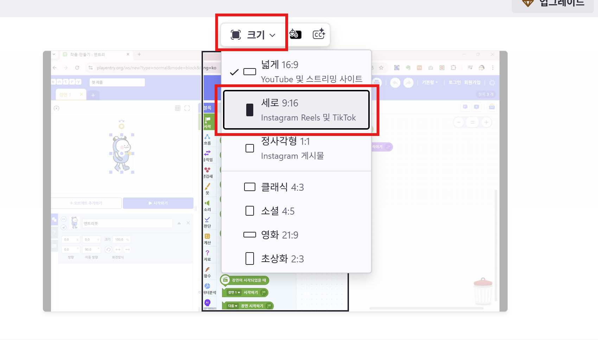

# 6. 동영상 편집하기

이번에는 우리가 만든 영상을 컴퓨터에서 멋지게 편집해보는 방법을 알아보아요.

**Clipchamp(클립챔프)** 라는 프로그램을 사용해서, 자르고, 음악도 넣고, 저장까지 해볼거에요.

> 💻 Clipchamp는 마이크로소프트에서 만든 무료 영상 편집 프로그램입니다.
> 윈도우11에서는 기본 설치돼 있고, 윈도우10은 [clipchamp.com](https://www.clipchamp.com/)에서 사용할 수 있습니다.

---

## 1단계. Clipchamp 켜기

1. 컴퓨터에서 **Clipchamp**를 찾아서 실행해요.

2. Microsoft 계정으로 로그인할 수도 있어요.

🖼 **캡처할 화면**:  
- Clipchamp 처음 실행 화면  

- '새 프로젝트 만들기(New Project)' 화면

---

## 2단계. 새 프로젝트 만들기

1. 화면에서 **[Create a new video]** 또는 **[새 비디오 만들기]** 버튼을 눌러요.
2. 프로젝트 이름은 ‘내 첫 영상’처럼 쉽게 지어요!

---

## 3단계. 영상 불러오기

1. 왼쪽에 있는 **[Your media]** 또는 **[사용자 미디어]** 클릭하기

2. **[Import media]** 또는 **[미디어 가져오기]** 버튼을 누릅니다.

3. 우리가 찍은 영상을 선택해요.

---

## 4단계. 영상 자르기

1. 불러온 영상을 아래 **타임라인(Timeline)** 에 드래그해서 넣어요.

2. 원하는 부분에서 자르고 싶으면,
   - 하얀 선을 자르고 싶은 위치로 옮기면 돼요

---

## 4-2단계. 화면 비율 바꾸기 (선택 사항)

1. 화면 상단에서 **[크기]** 버튼을 클릭합니다.
2. 원하는 화면 비율을 선택합니다. 예를 들어, 세로 9:16은 인스타그램 릴스나 틱톡에 적합해요.

---

## 5단계. 텍스트 자막 추가하기

1. 왼쪽에 있는 **[텍스트]** 또는 **[Text]** 메뉴를 클릭합니다.

2. 원하는 **텍스트 스타일**을 선택하고, 타임라인에 **[추가]** 버튼을 눌러요.

3. 타임라인에 추가된 텍스트를 더블 클릭하여 원하는 문구를 입력하고, 크기 및 위치를 조정해 보세요.

---
## 6단계. 음악 넣기 (배경 음악)

1. 왼쪽 메뉴에서 **오디오(Audio)** 또는 **음악**을 클릭해요.
2. 마음에 드는 음악을 찾아보고, 타임라인에 넣으세요.

3. 소리가 너무 크면, 음량을 줄여줄 수도 있어요!

---

## 7단계. 영상 저장하기

1. 오른쪽 위에 있는 **Export(내보내기)** 버튼을 클릭합니다.
2. 화질은 **1080p**로 선택하면 좋아요.

3. 저장이 끝나면 컴퓨터에 다운로드됩니다.

---

## 🎉 잘했어요!

이제 영상 편집을 끝냈어요!
다음에는 **휴대폰으로 편집하는 법**이나 **썸네일 만드는 법**도 배워볼 거예요.

---

> 📌 Tip: 처음엔 어렵지만, 자주 해보면 재미있고 쉬워져요!
> 선생님이나 친구랑 같이 해봐도 좋아요.