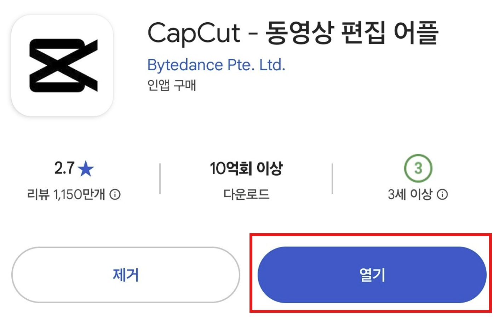
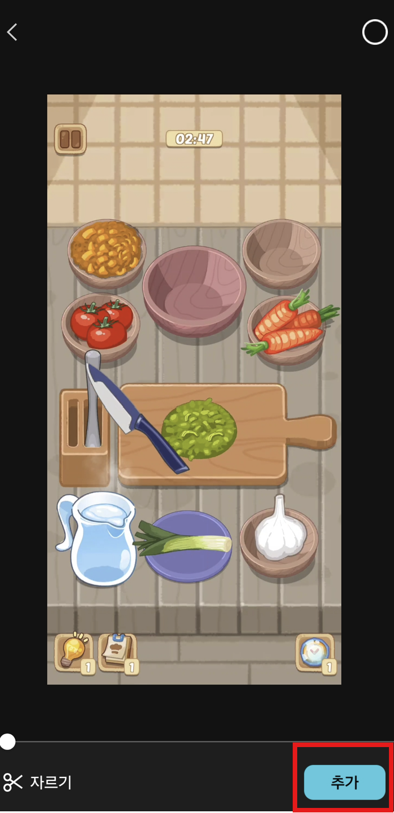
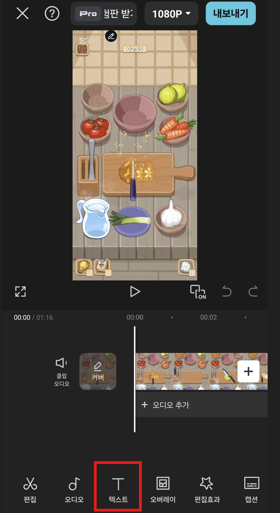
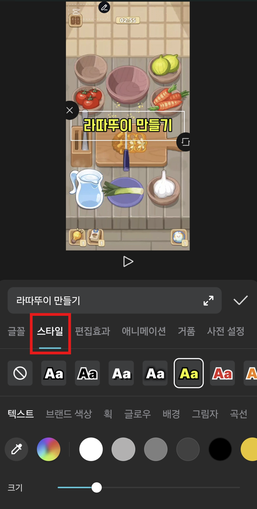
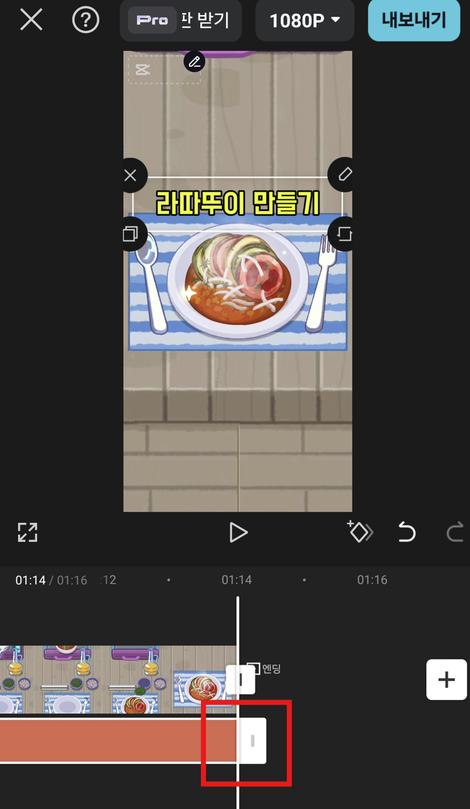
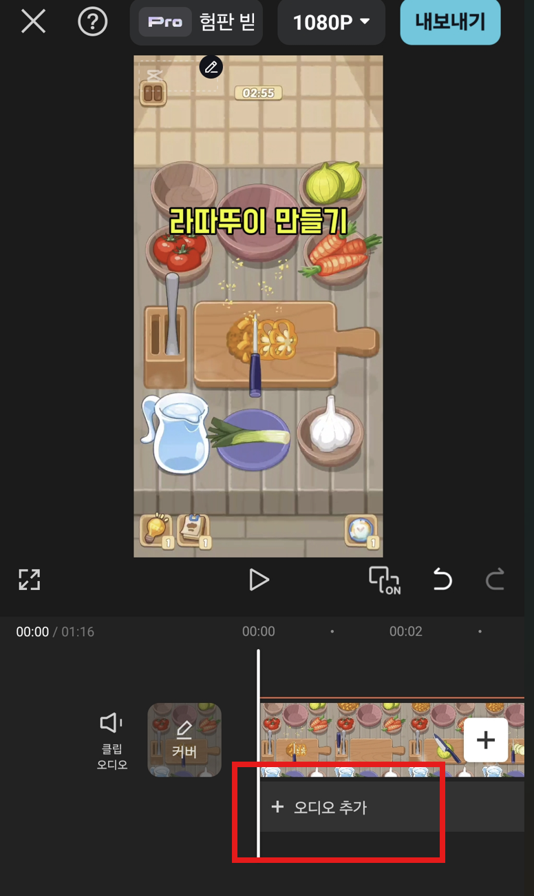
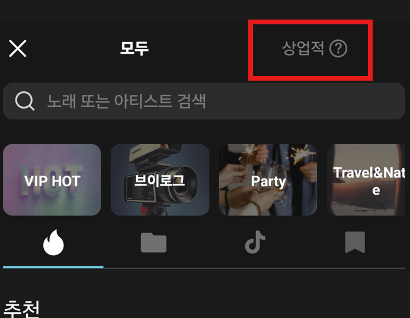
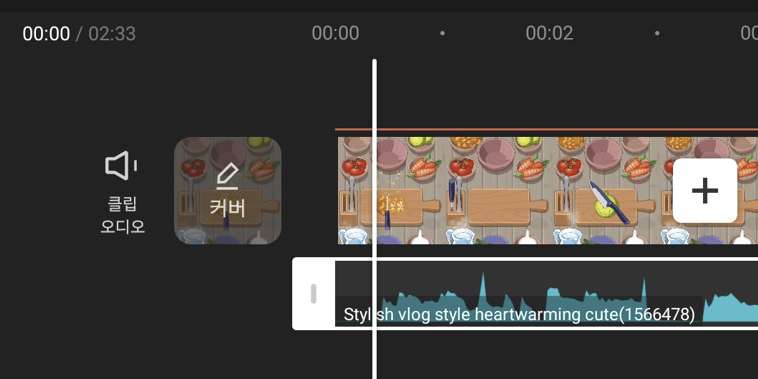
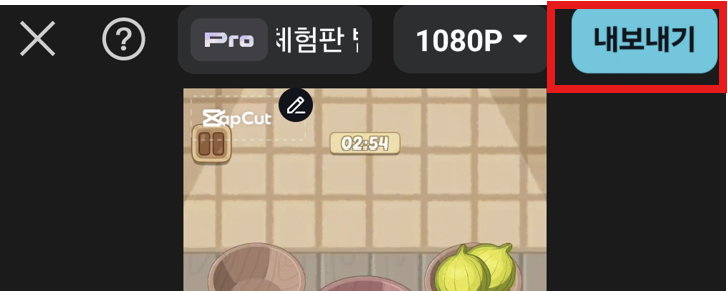
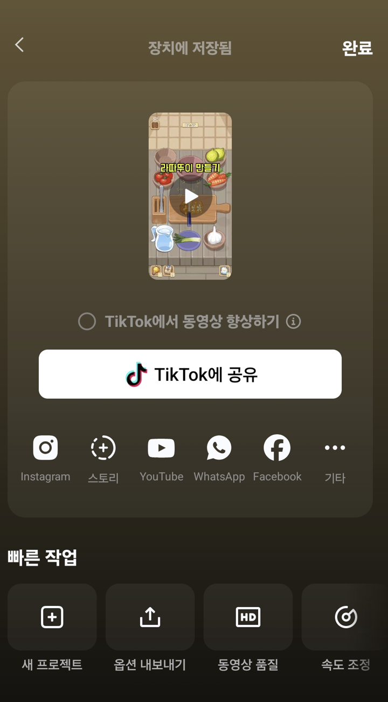

# 7. 모바일에서 동영상 편집하기 (CapCut)

> [!NOTE]
> 이 문서는 **2025년 7월 기준**으로, 스마트폰에서 **CapCut(캡컷)** 앱을 사용하여 동영상을 편집하는 방법을 안내합니다. CapCut은 직관적인 사용법과 다양한 기능 덕분에 모바일에서 가장 인기 있는 편집 앱 중 하나입니다.

## 7.1. CapCut 설치 및 새 프로젝트

1.  **앱 설치**
    사용하는 스마트폰의 앱 스토어(구글 플레이 스토어 또는 애플 앱스토어)에서 **'CapCut'**을 검색하여 설치합니다.

    

    > 앱 스토어에서 CapCut 검색 및 설치

2.  **새 프로젝트 시작**
    CapCut 앱을 실행하고 메인 화면에서 **'+ 새 프로젝트'** 버튼을 터치합니다.

    

3.  **영상 불러오기**
    스마트폰 앨범에 있는 비디오 중 편집할 영상을 선택하고 **'추가'** 버튼을 누릅니다.

    

## 7.2. 텍스트(자막) 추가 및 편집

1.  **텍스트 메뉴 열기**
    화면 하단의 도구 모음에서 **'T 텍스트'** 아이콘을 터치합니다.

    

2.  **자막 입력 및 스타일링**
    - **'AA 텍스트 추가'**를 선택하고 원하는 자막 내용을 입력합니다.
    - **'스타일'** 메뉴에서 글꼴, 색상, 테두리, 배경 등 다양한 효과를 적용하여 자막을 꾸밀 수 있습니다.

    

    > 텍스트 스타일을 변경하여 가독성을 높이는 모습

3.  **위치 및 길이 조절**
    타임라인에 생성된 텍스트 클립을 손가락으로 길게 누르거나 양쪽 끝을 드래그하여 자막이 나타나는 시간과 길이를 자유롭게 조절합니다.

    

## 7.3. 배경음악(BGM) 추가하기

1.  **오디오 메뉴 열기**
    하단 도구 모음에서 **'오디오'**를 선택한 후, **'사운드'** 아이콘을 터치합니다.

    

2.  **음악 선택 및 추가**
    CapCut이 제공하는 다양한 추천 음악 목록이 나타납니다. 원하는 음악을 선택하여 영상에 추가합니다.

    > [!IMPORTANT]
    > 음악 목록에서 **'상업적 사용 허용'** 필터를 적용하면 유튜브에 올려도 저작권 문제가 발생하지 않는 안전한 음원만 골라볼 수 있습니다.

    

    > 저작권 걱정 없는 상업용 음원 필터링

    

    > 영상 아래에 음악 트랙이 추가된 모습

## 7.4. 영상 저장하기 (내보내기)

1.  **내보내기 시작**
    모든 편집이 완료되었다면, 화면 오른쪽 상단의 **내보내기 아이콘(↑)**을 터치합니다.

    

2.  **저장 완료**
    잠시 기다리면 렌더링이 완료되고, 영상이 스마트폰 갤러리에 자동으로 저장됩니다. 이제 이 영상을 유튜브에 업로드할 수 있습니다.

    

---

모바일 앱을 활용하면 언제 어디서든 쉽고 빠르게 영상을 편집할 수 있습니다. 이제 직접 촬영한 영상을 편집하여 첫 유튜브 콘텐츠를 만들어볼 차례입니다.