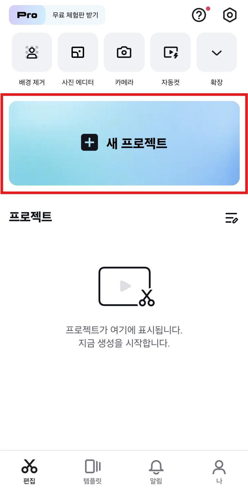

# 7. 휴대폰으로 영상 편집하기

이번에는 휴대폰에서 **CapCut(캡컷)** 이라는 앱으로 동영상을 멋지게 편집하는 방법을 알아볼거에요. 컴퓨터가 없어도 휴대폰만 있으면 멋진 영상을 만들 수 있어요!

> 📱 CapCut은 스마트폰에서 사용할 수 있는 무료 동영상 편집 앱입니다. 안드로이드와 아이폰 모두에서 다운로드할 수 있어요.

---

## 1단계. CapCut 다운로드 및 실행하기

1.  휴대폰에서 **CapCut 앱**을 다운로드하고 실행해요.
    
    * **안드로이드**: Google Play 스토어에서 "CapCut" 검색 후 설치
    * **아이폰**: App Store에서 "CapCut" 검색 후 설치
2.  앱을 실행한 후 **[새 프로젝트]** 버튼을 눌러 새로운 편집을 시작해요.
    

---

## 2단계. 동영상 추가하기

1.  **[새 프로젝트]** 를 누르면 휴대폰에 저장된 동영상과 사진 목록이 보여요.
2.  편집하고 싶은 동영상을 선택하고 **[추가]** 버튼을 눌러요.
    
3.  선택한 동영상이 아래 **타임라인(Timeline)** 에 나타날 거예요.

---

## 3단계. 텍스트 자막 추가하기

1.  아래 메뉴에서 **[텍스트]** 버튼을 클릭해요.
    
2.  **[텍스트 추가]** 를 누르면 타임라인에 텍스트 클립이 생겨요.
    
3.  타임라인에 추가된 텍스트 클립을 더블 클릭해서 원하는 글자를 입력해요.
    
4.  글자 입력 후, **[스타일]** 탭에서 글꼴, 색깔, 크기 등을 바꿀 수 있어요.
    
5.  텍스트 클립의 시작과 끝을 조절하여 자막이 나오는 시간을 설정해요.
    

---

## 4단계. 오디오 (음악) 추가하기

1.  아래 메뉴에서 **[오디오]** 버튼을 클릭해요.
    
2.  **[사운드]** 를 선택하거나, **[음악 가져오기]** 를 통해 휴대폰에 있는 음악을 불러올 수 있어요.
3.  '모두' 옆에 있는 **[상업적]** 탭을 눌러 저작권 걱정 없는 무료 음악을 찾아요.

4.  마음에 드는 음악을 고르고 **[+] 버튼** 을 눌러 타임라인에 추가해요.
    
    
타임라인에 추가된 모습
    

---

## 5단계. 영상 저장하기

1.  오른쪽 위에 있는 **[내보내기]** 버튼을 클릭해요.
    
2.  화질은 **1080p**로 선택하면 좋아요.
3.  저장이 끝나면 휴대폰 갤러리에 동영상이 저장돼요.
    

---

## 🎉 잘했어요!

이제 휴대폰으로도 멋진 영상을 만들 수 있게 되었어요! 다음에는 **썸네일 만드는 법**도 배워볼 거예요.

---

> 📌 Tip: CapCut은 다양한 기능이 많으니, 이것저것 눌러보면서 연습하면 더 재미있을 거예요!