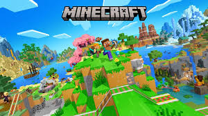

# 8. 첫 유튜브 영상, 어떻게 시작해야 할까?

> [!NOTE]
> 완벽한 시작보다는 첫걸음을 떼는 것에 집중합니다.

## 8.1. 무엇을 올려야 할지 막막하다면

> "시작이 반이다"라는 말처럼, 첫 영상은 누구에게나 어렵게 느껴집니다.

채널을 만들고 막상 영상을 올리려고 하면, 어떤 주제로 어떤 내용을 담아야 할지 막막하기만 합니다. 이 문서는 그런 분들을 위해 첫 영상을 기획하는 3단계 방법을 제안합니다.

## 8.2. 1단계: 인기 영상 분석하기

처음에는 제목, 썸네일, 편집, 영상의 흐름 등 모든 것이 낯설고 어렵습니다. 가장 좋은 방법은 내가 평소에 즐겨보던 영상들을 다시 한번 살펴보는 것입니다.

단, 그냥 시청하는 것이 아니라 **분석가의 눈**으로 봐야 합니다.

> [!IMPORTANT] > **영상을 보며 스스로에게 다음 두 가지를 질문해보세요.**
>
> 1.  **나는 왜 이 영상을 클릭했을까? (다른 영상을 보지 않고)**
> 2.  **나는 왜 이 영상이 재미있다고 느꼈을까?**

이 질문에 대한 답은 다양할 것입니다.

- 제목을 보니 내용이 너무 궁금해서
- 평소 내가 좋아하는 주제라서
- 크리에이터의 말이 재치 있고 재미있어서
- 예상치 못한 편집이나 효과가 웃겨서

이처럼 내가 영상을 선택하고 재미를 느낀 이유를 최대한 많이 찾아 목록으로 만들어보세요. 이것이 첫 영상을 만드는 가장 중요한 재료가 됩니다.

## 8.3. 2단계: 나의 주제 결정하기

이제 다른 사람의 영상이 아닌, **나의 이야기**를 할 차례입니다. 내가 평소에 좋아하고, 잘 알고 있으며, 다른 사람들에게 보여주고 싶은 것이 무엇인지 생각해보세요.

게임, 운동, 공부, 취미 등 모든 것이 영상의 주제가 될 수 있습니다.

> [!TIP]
> 유튜브 채널은 **하나의 명확한 주제**를 갖는 것이 좋습니다. 시청자들이 내 채널을 구독해야 할 이유를 분명하게 만들어주기 때문입니다. 오늘은 **첫 영상을 만들기 위한 계획**을 세우는 데 집중해봅시다.

## 8.4. 3단계: 잘 만든 영상 모방하기

마지막 단계는 내가 분석했던 영상 중 가장 마음에 드는 것을 **나만의 스타일로 모방(Benchmarking)하는 것**입니다.

> [!IMPORTANT]
> 여기서 **모방**은 콘텐츠를 그대로 베끼는 것이 아닙니다. 내가 분석했던 **성공 요인(재미, 구성, 편집 스타일 등)을 참고하여 내 주제에 맞게 재창조**하는 과정을 의미합니다.

내가 왜 그 영상에 끌렸는지, 어떤 부분에서 재미를 느꼈는지 다시 한번 생각해보세요. 그리고 그 요소들을 내 영상에 어떻게 녹여낼 수 있을지 고민하며 첫 영상을 만들어보는 것입니다.

## 8.5. 너무 걱정하지 마세요

첫 영상부터 소위 '대박'을 터뜨리는 것은 거의 불가능에 가깝습니다. 처음에는 구독자가 없기 때문에 아무리 잘 만든 영상이라도 사람들에게 노출되기 어렵습니다.

중요한 것은 **첫 영상을 완성하고 채널에 올리는 경험 그 자체**입니다. 첫 영상을 올려야만 조회수, 댓글, 구독자 같은 데이터를 얻을 수 있고, 그 반응을 보며 다음 영상을 어떻게 개선해 나갈지 방향을 잡을 수 있습니다.

---

이제 여러분의 첫 영상을 만들 준비가 되었습니다. 너무 많은 고민보다는, 일단 시작해보는 용기가 필요합니다. 꾸준히 영상을 만들고 분석하며 개선하다 보면, 분명 좋은 결과를 얻을 수 있을 것입니다.
