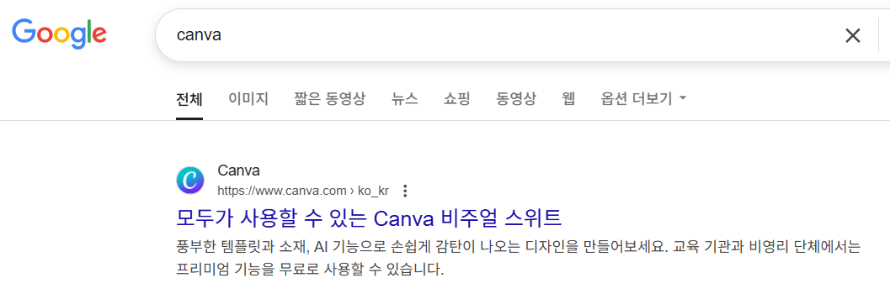
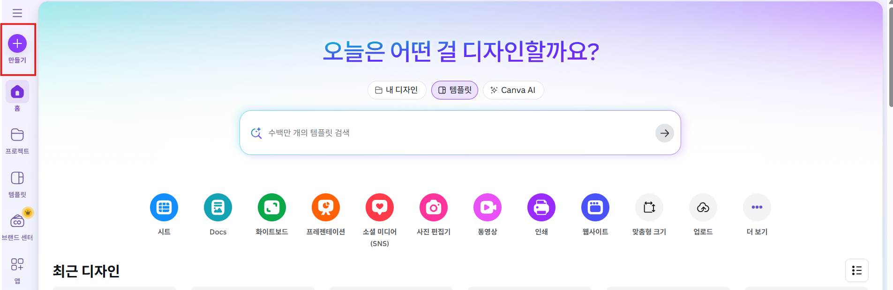
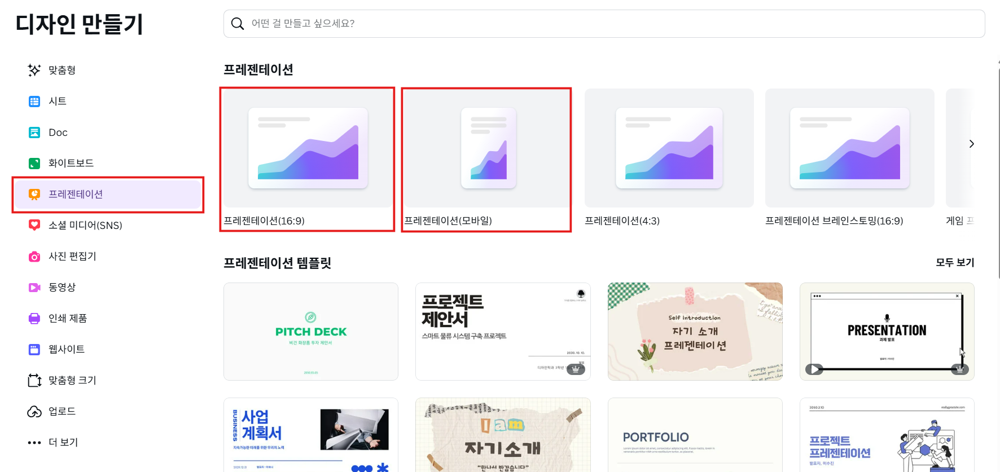
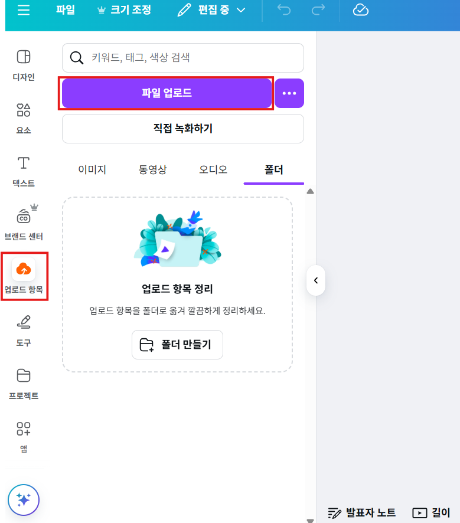
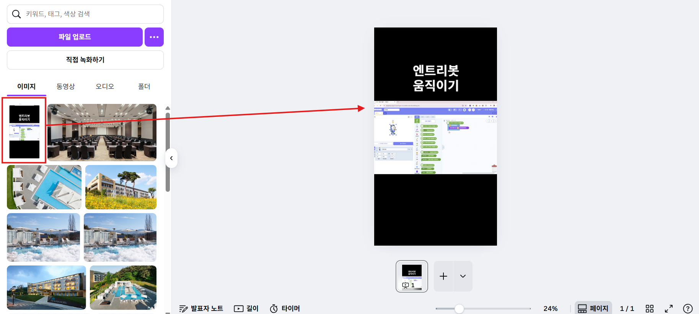
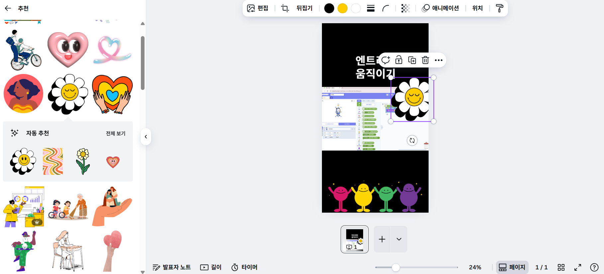
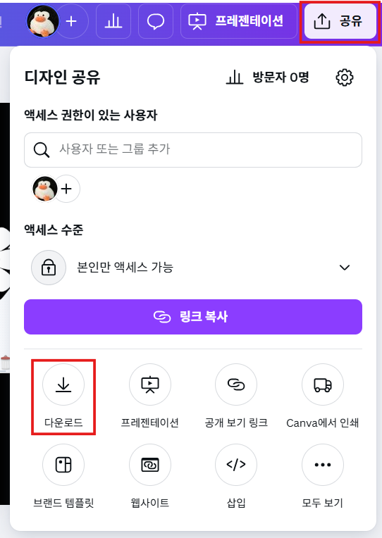
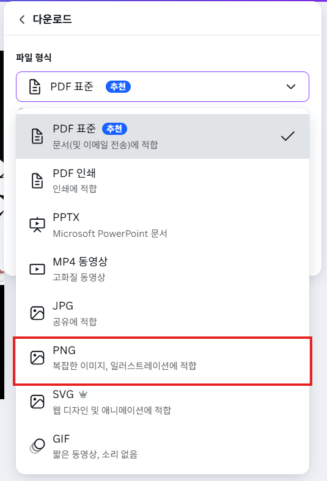
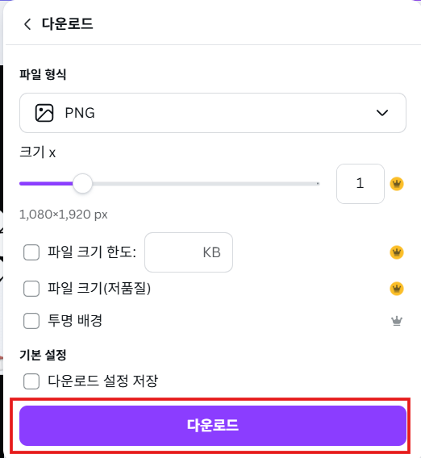

# 9. 영상의 얼굴, 썸네일 만들기 (Canva)

> [!NOTE]
> 이 문서는 **2025년 7월 기준**으로, 온라인 디자인 도구 **Canva(캔바)**를 사용하여 유튜브 썸네일을 만드는 방법을 안내합니다. 썸네일은 시청자가 영상을 클릭하게 만드는 매우 중요한 요소입니다.

Canva는 전문가가 아니어도 누구나 쉽고 빠르게 멋진 디자인을 만들 수 있도록 도와주는 서비스입니다. 웹사이트나 앱으로 이용할 수 있습니다.

## 9.1. Canva 접속 및 새 디자인 시작하기

1.  **Canva 접속**
    PC 또는 모바일 웹 브라우저에서 **[Canva 웹사이트](https://www.canva.com/)**에 접속합니다. 검색창에 'Canva'를 입력하여 쉽게 찾을 수 있습니다.

    

2.  **새 디자인 만들기**
    로그인 후, 화면 오른쪽 상단의 **'디자인 만들기'** 버튼을 클릭합니다.

    

3.  **크기 선택 (유튜브 썸네일)**
    검색창에 '유튜브'를 입력하거나 목록에서 **'유튜브 썸네일'**을 선택합니다. 이렇게 하면 썸네일에 가장 적합한 크기로 캔버스가 자동으로 설정됩니다.

    

    > 일반적인 가로 영상은 **16:9 비율**이 표준입니다.

## 9.2. 배경 이미지 설정하기

1.  **업로드 메뉴 선택**
    편집 화면 왼쪽의 메뉴 바에서 **'업로드 항목'**을 클릭합니다.

    

2.  **파일 업로드**
    **'파일 업로드'** 버튼을 눌러 썸네일 배경으로 사용할 이미지를 PC에서 선택하여 불러옵니다. (예: 영상의 한 장면을 캡처한 이미지)

3.  **배경으로 적용**
    업로드된 이미지를 클릭하여 캔버스에 추가한 후, 이미지의 모서리를 드래그하여 캔버스에 꽉 차도록 크기를 조절합니다.

    

## 9.3. 텍스트 및 요소로 꾸미기

썸네일은 시청자의 눈길을 사로잡는 것이 중요합니다. 텍스트와 다양한 디자인 요소를 활용해 보세요.

1.  **텍스트 추가**
    왼쪽 메뉴에서 **'텍스트'**를 선택하고, 원하는 스타일의 텍스트 상자를 추가하여 영상의 주제를 잘 나타내는 문구를 입력합니다.

2.  **요소 추가**
    - 왼쪽 메뉴에서 **'요소'**를 클릭합니다.
    - 검색창을 활용해 영상 내용과 관련된 아이콘, 스티커, 도형 등을 찾아 썸네일에 추가할 수 있습니다.
    - 추가된 요소는 크기와 위치를 자유롭게 변경할 수 있습니다.

    

    > '요소' 메뉴를 활용해 썸네일을 더욱 풍성하게 꾸미는 모습

## 9.4. 완성된 썸네일 저장하기

1.  **공유 및 다운로드**
    디자인이 완성되면, 오른쪽 상단의 **'공유'** 버튼을 클릭한 후, 나타나는 메뉴에서 **'다운로드'**를 선택합니다.

    

2.  **파일 형식 선택**
    파일 형식은 **PNG**로 선택하는 것을 권장합니다. PNG는 웹에서 이미지를 선명하게 보여주는 데 적합한 형식입니다.

    

3.  **저장 완료**
    보라색 **'다운로드'** 버튼을 클릭하면 완성된 썸네일 이미지가 PC에 저장됩니다.

    

---

이제 영상의 얼굴이 될 멋진 썸네일까지 만들었습니다. 이 썸네일은 나중에 유튜브에 영상을 업로드할 때 함께 등록하면 됩니다. Canva의 다양한 기능을 탐색하며 나만의 개성 있는 썸네일을 만들어보세요!