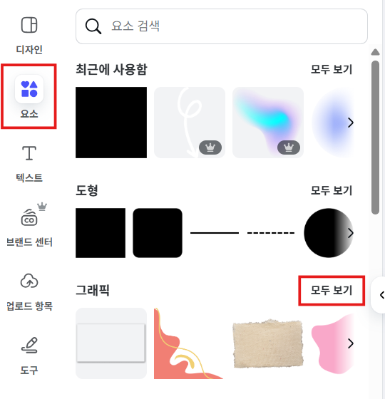

# 9. 썸네일 만들기

이번에는 영상의 얼굴이라고 할 수 있는 **썸네일** 을 멋지게 만들어 볼 거에요. 썸네일은 사람들이 네 영상을 클릭하게 만드는 아주 중요한 역할을 해요! 우리는 **Canva(캔바)** 라는 사이트를 사용해서 쉽고 예쁜 썸네일을 만들어 볼 거예요.

> 💻 **Canva(캔바)** 는 웹사이트나 앱에서 사용할 수 있는 디자인 도구예요. 전문가가 아니어도 멋진 디자인을 만들 수 있답니다!

---

## 1단계. Canva 접속 및 새 디자인 만들기

1.  컴퓨터나 휴대폰에서 **Canva 웹사이트**에 접속합니다.
    * 검색창에 'Canva'를 검색해서 접속할 수 있어요.
    
2.  Canva 메인 화면에서 왼쪽 위에 있는 **[만들기]** 버튼을 클릭합니다.
    
3.  **[프레젠테이션]** 메뉴를 선택하고, 자신의 영상의 비율에 맞는 크기를 고릅니다.
    * 보통 유튜브 썸네일은 **'프레젠테이션(16:9)'** 이 적합하고, 휴대폰 세로 영상 썸네일은 **'프레젠테이션(모바일)'** 이 좋아요.
    

---

## 2단계. 썸네일 배경 이미지 불러오기

1.  왼쪽 메뉴 바에서 **[업로드 항목]** 을 클릭합니다.
    
2.  **[파일 업로드]** 버튼을 눌러 썸네일로 사용하고 싶은 사진(영상의 중요한 장면 캡처본 등)을 컴퓨터에서 찾아 선택합니다.
3.  업로드된 이미지 목록에서 내가 올린 사진을 클릭하면, 편집 화면에 사진이 나타날 거예요.
    
4.  사진을 드래그하거나 모서리를 조절해서 썸네일 화면 전체에 맞게 크기를 조정해 줍니다.

---

## 3단계. 썸네일 꾸미기 (요소 추가)

1.  왼쪽 메뉴 바에서 **[요소]** 를 클릭합니다.
    
2.  다양한 '그래픽' 요소들을 볼 수 있는데, **[모두 보기]** 를 클릭하면 더 많은 디자인을 찾을 수 있어요.
3.  내 썸네일에 어울리는 스티커, 아이콘, 도형 등을 찾아 클릭하여 추가하고, 크기와 위치를 자유롭게 조절해서 멋지게 꾸며봐요.
    

---

## 4단계. 썸네일 다운로드하기

1.  썸네일 디자인을 완성했다면, 오른쪽 위에 있는 **[공유]** 버튼을 클릭합니다.
2.  팝업 메뉴에서 **[다운로드]** 를 클릭합니다.
    
3.  **[파일 형식]** 을 눌러서 **[PNG]** 를 선택해 주세요. PNG는 썸네일처럼 이미지를 깔끔하게 저장할 때 좋아요.
    
4.  마지막으로 보라색 **[다운로드]** 버튼을 클릭하면, 컴퓨터에 썸네일 이미지가 저장됩니다.
    

---

## 🎉 잘했어요!

이제 내 영상에 어울리는 멋진 썸네일까지 만들 수 있게 되었어요! 썸네일은 영상을 올릴 때 함께 사용하면 된답니다.

---

> 📌 Tip: 캔바에는 글자, 스티커, 배경 등 다양한 기능이 많으니, 직접 이것저것 눌러보면서 네만의 멋진 썸네일을 만들어 보세요!