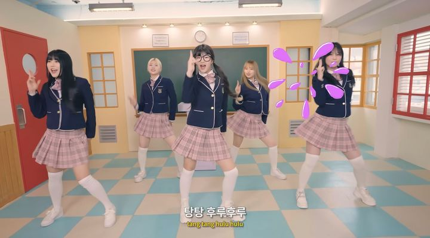
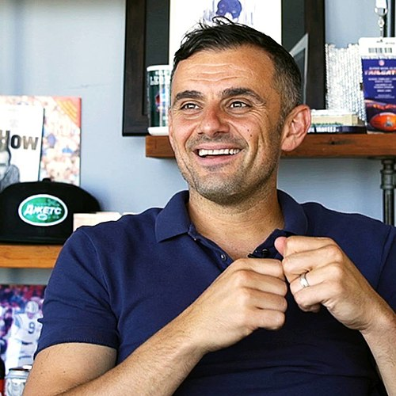
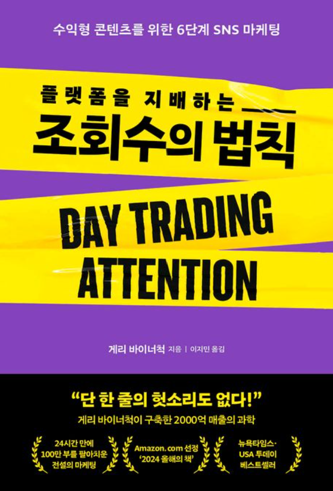
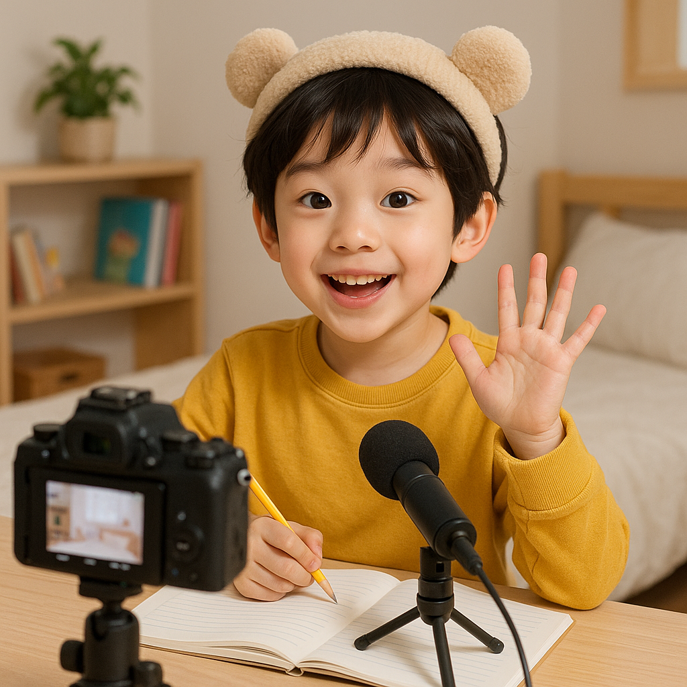
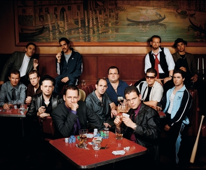

# 1. 왜 유튜버가 되고 싶을까?

> [!NOTE]
> '나도 유튜버가 되어볼까?' 어린이 여러분, 혹시 이런 생각해본 적 있나요?

요즘은 많은 어린이들이 장래희망으로 유튜버를 꿈꾼다고 해요. 유튜버가 되면 내가 좋아하는 게임을 하면서 돈도 벌 수 있고, 재미있는 영상을 만들어서 다른 사람들에게 보여줄 수도 있으니까요.

하지만 유튜버가 되는 것은 생각보다 쉽지 않아요. 어떤 주제로 영상을 만들지, 어떻게 촬영하고 편집할지, 또 어떻게 해야 사람들이 내 영상을 많이 보게 할 수 있을지 고민해야 할 것들이 많거든요.

그래도 걱정마세요! 이 책에서는 여러분이 유튜버가 되는 데 필요한 모든 것을 차근차근 알려줄 거예요. 함께 유튜버의 세계로 떠나볼까요?

---

## 1.1. 유튜버, 왜 하고 싶을까?

### 1.1.1. 내가 좋아하는 것을 다른 사람들과 나누고 싶어서

게임을 좋아하나요? 만들기를 좋아하나요? 아니면 노래 부르기를 좋아하나요? 내가 좋아하는 것을 영상으로 만들어서 다른 사람들에게 보여주고, 함께 즐거움을 나눌 수 있다는 것은 정말 멋진 일이에요.

### 1.1.2. 새로운 것에 도전하고 싶어서

유튜버가 되면 영상 기획, 촬영, 편집, 디자인 등 정말 다양한 것들을 배우게 돼요. 새로운 기술을 배우고, 나만의 콘텐츠를 만들어가는 과정은 여러분을 더욱 성장하게 만들 거예요.

### 1.1.3. 사람들에게 영향력을 주고 싶어서

'흔한남매'나 '에그박사'처럼 재미있는 영상으로 사람들에게 웃음을 주거나, 유용한 정보로 도움을 줄 수도 있어요. 선한 영향력으로 세상을 더 좋은 곳으로 만드는 데 기여할 수도 있답니다.

---

## 1.2. 유튜버가 되면 무엇을 할까?

### 1.2.1. 콘텐츠 기획

어떤 주제로 영상을 만들지, 어떤 내용을 담을지, 어떻게 재미있게 전달할지 고민하는 단계예요. 시청자들이 무엇을 궁금해하고, 무엇을 보고 싶어하는지 생각해보는 것이 중요해요.

### 1.2.2. 영상 촬영 및 편집

기획한 내용을 바탕으로 영상을 촬영하고, 컴퓨터나 스마트폰으로 편집해요. 자막을 넣고, 배경음악을 추가하고, 재미있는 효과를 넣어서 영상을 더욱 풍성하게 만들 수 있어요.

### 1.2.3. 채널 운영 및 소통

유튜브에 영상을 올리고, 채널을 꾸미고, 시청자들과 댓글로 소통해요. 사람들이 내 영상에 어떤 반응을 보이는지 살피고, 다음 영상에 반영하는 것도 중요해요.

---

## 1.3. 유튜버, 아무나 할 수 있을까?

물론이에요! 나이, 성별, 국적에 상관없이 누구나 유튜버가 될 수 있어요. 가장 중요한 것은 **'꾸준함'**이에요. 처음에는 구독자도 별로 없고, 조회수도 낮을 수 있어요. 하지만 포기하지 않고 꾸준히 재미있는 영상을 만들다 보면, 어느새 많은 사람들이 여러분의 채널을 찾아줄 거예요.

---

## 1.4. 수익 창출

유튜브 채널이 일정 조건을 만족하면 (구독자 1000명, 시청 시간 4000시간) 광고를 통해 수익을 얻을 수 있어요. 또한, 기업으로부터 협찬을 받거나, 나만의 상품을 판매할 수도 있답니다.

