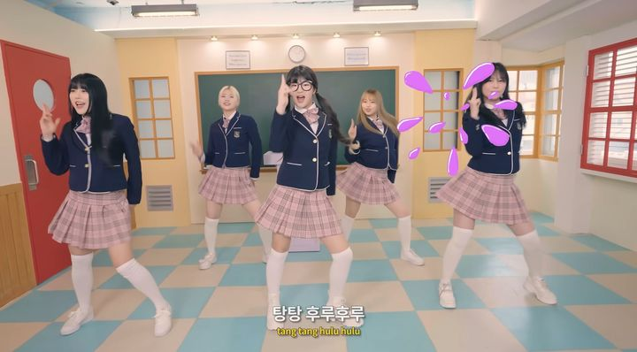
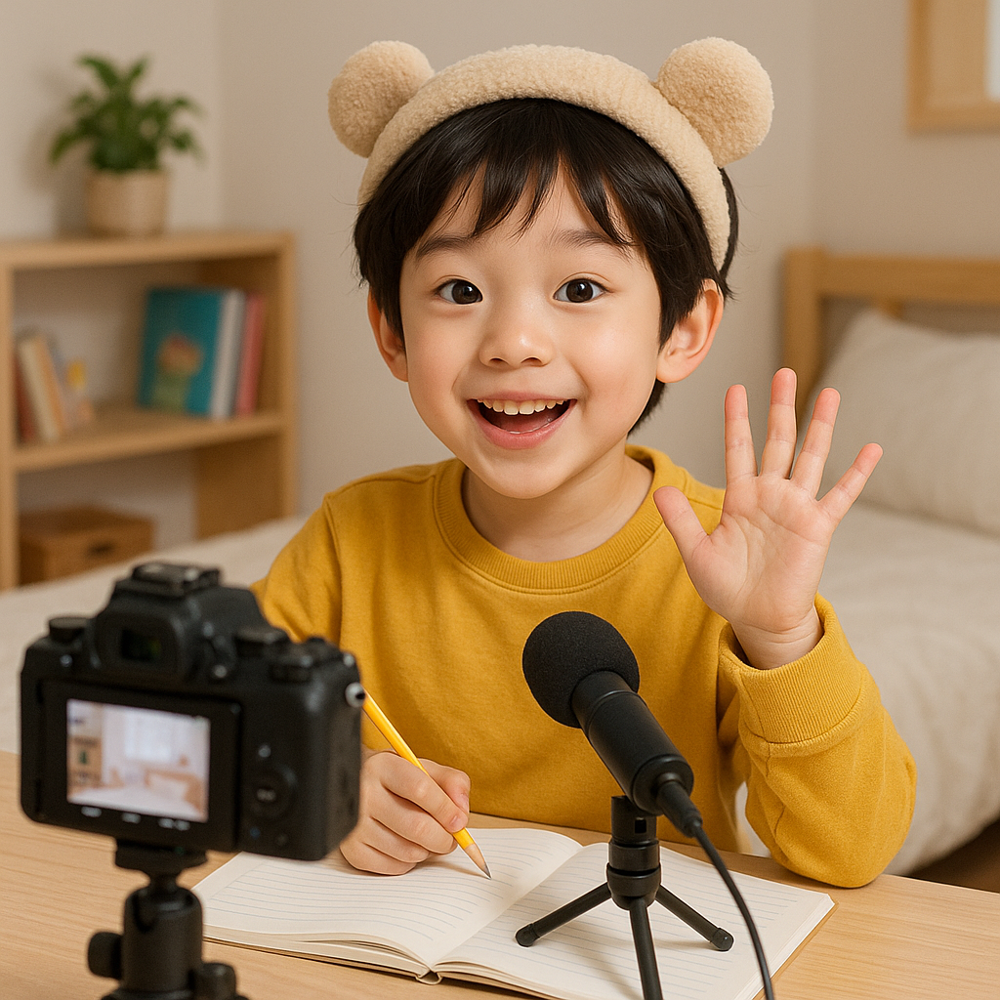

# 📣 엄마, 나 유튜버 할래요

요즘 **서이브(SeoEve)**의 ‘(마라탕후루)[https://www.youtube.com/watch?v=Cs35Hv33dK0]’ 춤, 들어보셨나요?  
초등학생 크리에이터인 서이브가 선보인 이 춤은 “탕탕 후루후루”라는 리듬감 넘치는 후렴으로 작년 SNS와 틱톡을 뜨겁게 달궜답니다.  
MZ세대뿐만 아니라 ‘침착맨’, ‘잇섭’ 등 30·40대 크리에이터들도 따라할 정도로 인기를 끌었어요.  
정말 **신드롬**이었죠!

---

## 우리 아이만 그런 거 아니에요?

실제로, **경남지역 초등학교 4~6학년 중 18.9%**가  
장래 희망 1위로 ‘유튜버’를 꼽았다는 설문조사 결과도 있어요.  
(기사 링크)[https://www.nocutnews.co.kr/news/5937146]
디지털 네이티브 세대에게 유튜브는 단순한 놀이가 아닌, **창의력을 펼치는 플랫폼**이 된 셈이죠.

---

## 유튜브, 시작해도 될까?

물론 걱정이 많죠.  
> 게임 영상만 올리면?  
> 학업·생활 균형이 깨질까 우려되기도 하고요.

하지만 아이가 **취미나 학습 활동을 콘텐츠화**한다면 이야기가 달라집니다.  
예컨대, 그림 그리기, 책 리뷰, 코딩 프로젝트 등 **자기 주도적 활동**을 영상으로 남기고  
피드백을 받으며 **성취감과 동기**가 상승하는 사례도 있어요.

---

### 🎥 해달에듀의 아이들은 어땠을까요?

> “코딩 프로젝트를 영상으로 공유하자 오히려 더 공부에 집중하게 되었다”

아이들이  
- “더 나은 프로젝트를 만들어봐야지!”  
- 조회수와 구독자 수가 늘어나는 것을 보며 **성취감을 경험**

결국, 유튜브는 **단순 놀이가 아닌 학습과 성장 플랫폼**으로도 활용 가능하답니다.  
물론, **부모님의 안전한 지도와 관심은 필수**입니다.

---

## 3️⃣ 그렇다면 어떻게 해야 할까요?

단순히 유튜브 채널 만드는 방법만 알려주는 것은 아니겠죠?

**해달에듀**는  
- 직접 SNS 채널을 운영하며 얻은 실전 노하우  
- **글로벌 마케팅 구루 '게리 바이너척'**의 책  
   
  을 통해 얻은 인사이트를 함께 전합니다.

> **그렇다면 채널 생성부터 차근차근 시작해볼까요?**

👉 [유튜브 채널 생성하는 방법 보러가기](#)

---

## 4️⃣ 마무리: 아이들의 꿈을 응원합시다 🌱

우리가 어린 시절에 장래희망으로 **대통령과 과학자**를 적고  
이를 이루기 위해 더 공부하고, 더 노력했던 기억이 있으시죠?

지금 우리 아이들은 그 자리에 **유튜버**를 꿈꿉니다.  
아이들의 마음 속 한자리를  
- 후회와 아쉬움으로 채울지  
- 즐거움과 성장으로 채울지는  

**부모님에게 달려 있습니다.**

---

## 5️⃣ 해달에듀에서 진행하는 코딩 수업은 어떨까?

👉 [엄마 나 카이스트 갈래요~ (링크)](https://blog.naver.com/haedaledu/223369992921)

---

## 6️⃣ 집에서 유튜브를 혼자 하려니 너무 어렵다면?

👉 [해달에듀 코딩학원 위치 (네이버 지도)](https://naver.me/G65r6kxl)

---

## 7️⃣ 태그

`#해달에듀` `#유튜버` `#초등유튜버` `#코딩` `#유튜버되는법` `#엄마나유튜버할래요` `#마라탕후루` `#초등학생`
