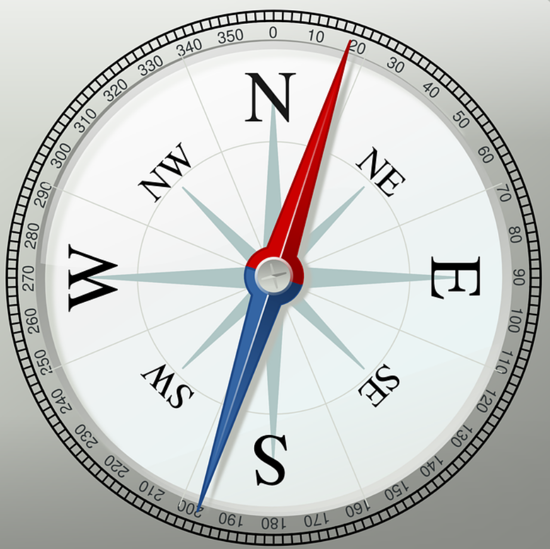

# 📣 엄마, 나 유튜버 할래요 | 초등학생 유튜버에 관한 모든 것 | 유튜버 해도 될까? | 유튜버와 관련된 모든 고민 해결

요즘 **서이브(SeoEve)**의 ‘[마라탕후루](https://www.youtube.com/watch?v=Cs35Hv33dK0)’ 춤, 들어보셨나요?  
초등학생 크리에이터인 서이브가 선보인 이 춤은 “탕탕 후루후루”라는 리듬감 넘치는 후렴으로 작년 SNS와 틱톡을 뜨겁게 달궜답니다.  
MZ세대뿐만 아니라 ‘침착맨’, ‘잇섭’ 등 30·40대 크리에이터들도 따라할 정도로 인기를 끌었어요.  
정말 **신드롬**이었죠!

마라탕후루 이전에도 마이린(1113만 유튜버)(링크), 띠예(65만 유튜버)(링크) 등 많은 키즈 유튜버들이 존재했고,
도티(237만 유튜버)(링크), 옐언니(439만 유튜버)(링크) 등 많은 유튜버들을 보며
아이들에게 유튜버의 꿈이 생기기 시작했습니다.

---

## 우리 아이만 그런 거 아니에요?

실제로, **경남지역 초등학교 4~6학년 중 18.9%**가  
장래 희망 1위로 ‘유튜버’를 꼽았다는 설문조사 결과도 있어요.  
[기사 링크](https://www.nocutnews.co.kr/news/5937146)
디지털 네이티브 세대에게 유튜브는 단순한 놀이가 아닌, **창의력을 펼치는 플랫폼**이 된 셈이죠.

---

## 우리 아이 유튜버 해도 될까요..?

과거 안 좋은 유튜버들이 일부 존재했고,
그런 유튜버들을 뉴스나 기사로 많이 접한 부모님들은
유튜버가 아니라 유튜브 자체를 상당히 해로운 플랫폼으로
인식합니다.
게다가 우리 아이가 유튜버라니... 조금만 생각해도
- 유튜버가 직업이 될 수 있어요?
- 유튜브가 망하면 어떡해요?
- 아이에게 안좋은 영향을 주는거 아니에요?
- 게임만 더 많이 할 것 같은데...
등등 많은 고민이 생기는데요?
우리 아이 유튜버 해도 될까요..?

---

## 유튜버가 직업이 될 수 있어요?

유튜버는 충분히 직업이 될 수 있습니다! 하지만, 유튜버가 좋은 직업이라고는 하기 힘듭니다.
유튜버로써 성공하기위해서는 난이도가 매우 높으며, 유튜버가 된다고 하여도 만약 어떠한 사건을
계기로 더이상 유튜버로써 활동을 하지 못하게 된다면 다른 직업을 가지는 것도 쉽지 않습니다.

---

## 유튜브가 사라지면 어떡해요?

게다가 유튜브나 인스타그램의 트렌드는 계속해서 바뀝니다. 유튜브가 사라지는 것을
걱정하기보다, 바뀌는 트렌드에 계속해서 적응하지 못하면 성공한 유튜버라도
금방 사람들의 기억속에서 잊혀질 것입니다.

---

## 아이에게 안좋은 영향을 주는건 아니에요?

물론 걱정이 많죠.  
> 게임 영상만 올리면?  
> 학업·생활 균형이 깨질까 우려되기도 하고요.

---

## 그렇다면 유튜버는 역시 안되겠죠..?

아이가 어린 나이부터 유튜버를 직업으로 가지는 것은 좋은 선택이 아닐 확률이 높습니다.

하지만 아이가 **취미나 학습 활동을 콘텐츠화**한다면 이야기가 달라집니다.  
예컨대, 그림 그리기, 책 리뷰, 코딩 프로젝트 등 **자기 주도적 활동**을 영상으로 남기고  
피드백을 받으며 **성취감과 동기**를 느낄 수 있는 도구로 사용한다면 이야기는 완전히 달라집니다.

유튜브를 
- 돈을 벌기 위해서
- 게임을 하기 위해서

사용하는 것이 아니라
- 자신의 기록을 남기기위해서
- 성장을 위한 동기부여를 얻기위해서
- 다양하고 많은 피드백을 얻기위해서
사용한다면 이는 강력한 도구가 될 수 있습니다.

---

### 🎥 해달에듀의 아이들은 어땠을까요?

> “코딩 프로젝트를 영상으로 공유하자 오히려 더 집중하게 되었습니다!”

아이들이  
- “더 나은 프로젝트를 만들어봐야지!”  
- 조회수와 구독자 수가 늘어나는 것을 보며 **성취감을 경험**

결국, 유튜브는 **단순 놀이가 아닌 학습과 성장 플랫폼**으로도 활용 가능하답니다.  
물론, **부모님의 안전한 지도와 관심은 필수**입니다.

---

## 3️⃣ 그렇다면 어떻게 해야 할까요?

"막상 유튜브를 시작하려니, 채널 생성부터 어려워요..."
유튜브 생성부터 영상 제작까지 하나하나 모두 가르쳐 드립니다!
유튜버로 성공하는 정답이 아닌 방향을 알려드립니다.

---

## 3️⃣ 왜 정답은 안알려줘?

유튜브뿐만이 아니라 모든 SNS에서 트렌드는 계속해서 바뀝니다.
그렇기에 지금 당장 정답인 방법이 한 달만 지나도 오답이 될 수 있어요.
그렇기에 해달은 정답이 아닌 
- 트렌드를 어떻게 파악하는지
- 통계를 보고 다음 방향을 어떻게 결정하는지
- 영상 주제를 어떻게 떠올리는지
와 같은 방향을 여러분들에게 제시합니다.

---

## 제대로된 방향이 맞아?

최근 계속해서 이슈가 되고 있는 "일론머스크"라는 인물을 들어보셨을까요?
물론 많은 논란이 따라오지만 그가 엄청나게 성공하였고 강한 영향력을 가진 사람이라는 것은
부정할 수 없는 사실입니다.

"일론머스크"를 포함해 엄청난 성공과 함께 강한 영향력을 끼치는 페이팔 마피아라는 사람들 있습니다.
해달에듀는 페이팔 마피아에서도 가장 뛰어난 마케팅 기술을 가지고 있는 게리 바이너척의
조회수의 법칙을 활용하여 마케팅을 진행합니다.

**해달에듀**는  
- 직접 SNS 채널(해달 유튜브, 인스타 필요)을 생성 및 운영한 노하우
- 팔로원 1만 이상, 조회수 1천만 이상을 만들어낸 비결
- 유튜버로 수익을 낼 수 있는 방법
- 실제 아이들이 유튜브를 활용하여 성장한 경험
  을 전합니다.

> **그렇다면 채널 생성부터 차근차근 시작해볼까요?**

👉 [유튜브 채널 생성하는 방법 보러가기](#)

---

## 4️⃣ 마무리: 아이들의 꿈을 응원합시다 🌱

우리가 어린 시절에 장래희망으로 **대통령과 과학자**를 적고  
이를 이루기 위해 더 공부하고, 더 노력했던 기억이 있으시죠?

지금 우리 아이들은 그 자리에 **유튜버**를 꿈꿉니다.  
아이들의 마음 속 한자리를  
- 후회와 아쉬움으로 채울지  
- 즐거움과 성장으로 채울지는  

**부모님에게 달려 있습니다.**

---

## 5️⃣ 해달에듀에서 진행하는 코딩 수업은 어떨까?

👉 [엄마 나 카이스트 갈래요~ ](https://blog.naver.com/haedaledu/223369992921)

---

## 6️⃣ 집에서 유튜브를 혼자 하려니 너무 어렵다면?
아이들이 유튜브를 안좋은 방향으로 사용할까 두렵다면?
유튜브를 시작하는 것이 너무 어렵다면?
👉 [해달에듀 코딩학원 위치 (네이버 지도)](https://naver.me/G65r6kxl)

---

## 7️⃣ 태그

`#해달에듀` `#유튜버` `#초등유튜버` `#코딩` `#유튜버되는법` `#엄마나유튜버할래요` `#마라탕후루` `#초등학생`
