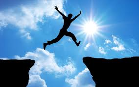
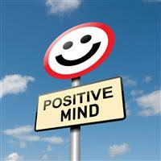

# 유튜브에 영상을 올리려는데 어떤 영상을 올려야 할까요?

이 글은 유튜브의 첫 영상을 기획하는 것에 대해서 다룹니다.  
영상을 올릴 유튜브 채널이 없다면?  
[유튜브 채널 생성하는 방법](링크)

시작이 반이라는 말이 있는 것처럼 시작은 항상 매우 어렵게 느껴지는데요.  
오늘은 유튜브에 어떤 영상을 올릴지 고민인 사람들을 위해 유튜브 첫 영상을 만드는 방법을 알려드리겠습니다.

---

## 1. **영상 시청**

처음 영상을 만들 때는 제목, 썸네일, 편집 스타일, 영상 주제, 영상의 흐름 등등 어떠한 것도 잘 모르는 상태일 것입니다.  
그렇기에 우리는 평소에 재미있다고 생각했거나 자주 시청하던 영상들을 먼저 시청해야 합니다.  
하지만 영상을 그냥 웃으면서 보기만 해서는 안 됩니다.  
영상을 보며 다음 2가지를 찾아주세요:

1. 내가 왜 이 영상을 시청했을까? (넘기지 않았을까?)  
2. 내가 왜 이 영상을 재미있다고 생각했을까?

이 2가지는 다양한 이유가 있을 것입니다.

- 제목을 보니 내용이 궁금해서
- 내가 좋아하는 주제와 같아서
- 말하는 게 재미있어서
- 영상 편집이 웃겨서

이처럼 최대한 많은 이유를 찾아주세요.

---

## 2. **주제 결정**

유튜브에 어떤 영상을 올리고 싶으신가요?  
내가 평소에 좋아하는 것이나 재미있다고 느꼈던 것들, 잘 알고 있거나 보여주고 싶은 것들을 주제로 결정해주세요.

예시:

- 게임

- 운동

- 공부
- 몰래카메라
- 취미
- 도전

등등 많은 것들이 영상의 주제가 될 수 있습니다.  
유튜브 채널에는 주제가 있는 것이 좋습니다. 이는 많은 이유가 있지만, 오늘은 **어떤 영상을 만들지 계획하기 위해서**라고 생각하시면 됩니다.

---

## 3. **모방**

마지막으로 해야 할 것은 영상을 주제에 맞게 최대한 **모방**하는 것입니다.  
시청했던 영상 중 가장 재미있는 영상을 정하고, 이를 자신의 색깔로 똑같이 만듭니다.

영상이 선택되고 재미있다고 느껴지는 이유는 매우 많습니다.  
물론 아무리 많은 이유를 찾았도 내가 모르는 이유가 더 많습니다.  
첫 영상을 만들 때는 내가 재미있다고 느꼈던 부분들을 최대한 똑같이 **모방**하며, 다른 부분들도 최대한 **모방**해봅시다.

---

## 예시 과정

이제 첫 번째 영상을 만들어봅시다. 위에서 나왔던 내용부터 차근차근 같이 해볼까요?

## 영상 시청
저는 제가 많이 보던 마인크래프트 유튜브 영상을 시청했습니다.  
[링크](https://www.youtube.com/shorts/I72Aa780-Qw)

제가 이 영상을 시청한 이유는:
- 시작부터 화면에서 제가 좋아하는 마인크래프트가 나왔고
- 영상 시작에 나온 *"마인크래프트인데 해리포터가 되었습니다"*라는 말이 궁금했고
- 궁금하다는 생각 중에 결과가 바로 영상에서 나왔기 때문입니다.

제가 이 영상이 재미있다고 생각한 이유는:
- 제가 평소에 마크에서 하지 못했던 마법들을 볼 수 있었고
- 영상에 들어간 노래가 주제와 잘 어울렸고
- 영상 중간마다 나오는 편집들이 재미있었기 때문입니다.

## 주제 설정

[코딩 뭐야 해달에듀야~](https://www.youtube.com/watch?v=ov7FHiH-wWU)

저는 평소에 코딩하는 것을 매우 좋아하고, 코딩으로 만든 결과물을 보여주고 싶기 때문에 **코딩**을 주제로 결정했습니다.

---

## **모방한 영상 제작**

이제 영상을 **모방**해보겠습니다.

- 다른 사람들이 궁금해하고 모르는 제가 직접 만든 프로젝트를 보여주고
- 제가 좋아하는 노래도 넣고
- 영상 시작부터 제가 좋아하는 *엔트리*라는 단어를 넣고
- 영상의 주제인 슬라임 침공을 직접 읽고
- 결과물을 바로 보여주었습니다.

[결과물 링크](https://www.youtube.com/shorts/c5akJhmM35c)

---

## **마무리**

첫 영상을 만드는 과정은 매우 어렵습니다.  
하지만 다른 사람의 영상을 **모방**하는 방법을 사용한다면 조금 더 쉽게 만들 수 있습니다.

첫 영상부터 성공하기는 쉽지 않습니다.  
내가 재미있다고 생각했던 부분이 실제로는 다른 부분일 수도 있고, 내가 재미있게 느끼는 부분이 다른 사람들에게는 재미없을 수도 있습니다.  
그렇기에 우리는 **이미 성공한 다른 사람의 영상을 최대한 모방**해야 합니다.
물론 영상을 그대로 **뺏기는 것이 아니라** 나의 스타일 대로 **모방**해야하는 것이 가장 중요합니다!

첫 영상을 올리기 전부터 너무 많은 고민을 하는 것보다, 우선 첫 영상을 올리고 조회수나 댓글, 구독자 반응을 확인하며 조금씩 개선해 나가는 것이 가장 쉽고 효과적인 방법입니다.

---

### **조회수가 낮아도 걱정하지 마세요**

첫 영상을 올린 것으로 벌써 절반 이상 성공했습니다! 
아무리 잘 만든 영상이어도 처음에는 팔로워가 없기 때문에 알고리즘에 선택되기 어렵습니다.  
하지만 주제에 맞는, 재미있는 영상을 계속 올린다면 팔로워는 천천히 늘어날 것입니다. 이제 꾸준히 영상을 올리기만 해도 나머지 절반은 따라올 것입니다.
물론, 영상을 올리며 *"왜 영상이 재미있지?"* *"왜 성공하는 거지?"* 같은 고민을 계속하는 것이 필수입니다.
매번 영상을 올릴 때마다 처음과 같은 마음으로 시도해봐요!

---

## **다른 친구들은 어떤 영상을 올리고 있을까?**
- [해달즈 구경하기](https://www.youtube.com/@haedaledu)

## **그래도 첫 영상이 너무 어렵다면?**
- [해달에듀](https://naver.me/G65r6kxl)

## **위에서 본 코딩이 재미있어 보인다면?**
- [카이스트](https://blog.naver.com/haedaledu/223369992921)

---

**태그**
